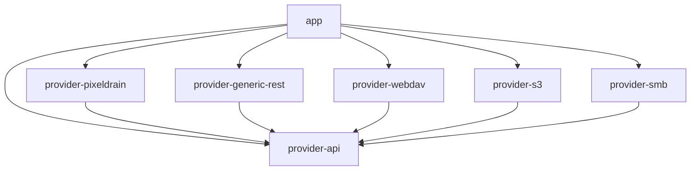
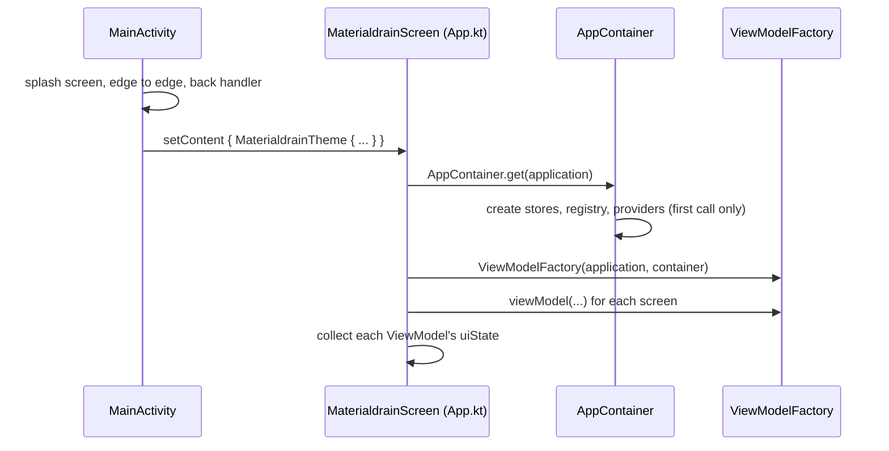
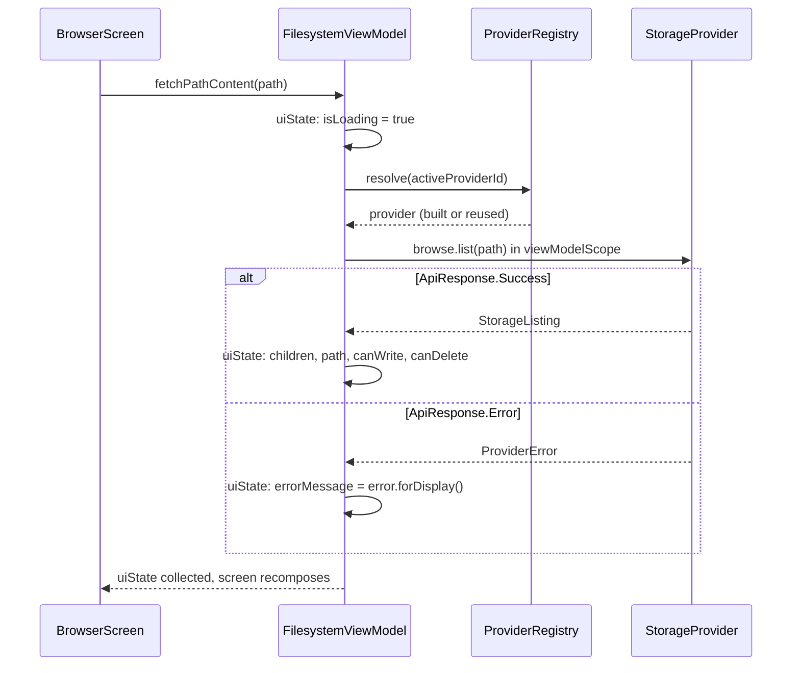

# Architecture

Materialdrain is one Android app built from seven Gradle modules. The app module holds the screens; six library
modules hold the hosts. This page shows how they fit together, how the app starts, and how a tap on a screen turns into
a request and back into something on the screen.

## The modules

| Module | What it holds |
| --- | --- |
| `app` | The activity, every screen, the ViewModels, settings, transfers, the stored host configs and their updates |
| `provider-api` | The contract every host implements (`StorageProvider` and its ops), the shared models, the config classes and their JSON codec. No HTTP code |
| `provider-pixeldrain` | The built-in Pixeldrain host, and the Pixeldrain account login. Ktor for JSON calls, OkHttp for streaming |
| `provider-generic-rest` | `generic_rest` configs: any HTTP API described request by request. OkHttp |
| `provider-webdav` | `webdav` configs: Nextcloud, ownCloud, TrueNAS and other WebDAV servers. OkHttp |
| `provider-s3` | `s3` configs: any S3-compatible bucket, with its own SigV4 signer. OkHttp |
| `provider-smb` | `smb` configs: Windows, Samba and NAS shares, through jcifs-ng |

All seven are listed in `settings.gradle.kts`. Every host module is an Android library (`minSdk` 29), since the ops
take Android types such as `Uri` and `Context`.



Each arrow is an `implementation(project(...))` line in the module's `build.gradle.kts`. The host modules only know
`provider-api`, never each other.

### Why the hosts are separate modules

The screens and ViewModels only ever talk to the types in `provider-api`. The comment on `StorageProvider` says it
plainly: *"The UI never talks to Pixeldrain/WebDAV/S3/generic-REST types directly — it goes through this interface and
reads `capabilities` to know what it can show."* Keeping each host in its own module makes that a rule the build
enforces rather than a habit:

- **A host can't leak into another.** `provider-webdav` can't reach into `provider-s3`, because it doesn't depend on
  it. What they share has to go through `provider-api`.
- **Each host brings only its own libraries.** jcifs-ng is only in `provider-smb`. The S3 module signs
  requests itself rather than pulling in the AWS SDK, *"which would drag in a large dependency graph for three HMAC
  calls"* (from `S3Signer`).
- **Each host is tested on its own.** The config-driven host modules (REST, WebDAV, S3, SMB) and `provider-api` have
  their own unit tests, run on the plain JVM (the WebDAV provider uses `java.net.URLEncoder` instead of
  `android.net.Uri` for exactly that reason).
- **`provider-api` can't see the app.** For example the app's `Screen` enum can't be referenced from there, so
  `HostScreen.toScreen()` in `Navigation.kt` is the one place the two are matched up.

The app module does depend on every host module, but it only names their classes in a few places:

| Where | Why |
| --- | --- |
| `provider/ProviderRegistry.kt` | Builds the right `StorageProvider` for each kind of config |
| `AppContainer.kt` | Creates the built-in `PixeldrainStorageProvider`, and tells `SmbContentServer` where to cache thumbnails |
| `auth/SessionManager.kt`, `preferences/AuthViewModel.kt` | The Pixeldrain account login, which has no equivalent on other hosts |

Everything else, from the Files screen to the transfer notifications, works the same for every host.

## Inside `app`

All packages are under `tools.senko.materialdrain`.

| Package | What it holds |
| --- | --- |
| (top level) | `MainActivity`, `App.kt` (the Compose shell), `Navigation.kt`, `AppContainer`, `ViewModelFactory` |
| `browser` | `BrowserScreen`, the one screen behind Files, Lists and Filesystem, its controls and the search results |
| `files` | The Files screen's ViewModel (`FileInfoViewModel`), the file details page, file menus, sorting, archive contents, text highlighting |
| `filesystem` | `FilesystemViewModel`: folder browsing, uploads into folders, the folder tree index for search |
| `upload` | The Upload screen and `UploadViewModel` |
| `lists` | `ListViewModel`: lists of files and their contents |
| `transfer` | `TransferRegistry` (every running upload and download), the foreground `TransferService`, notifications, speed |
| `provider` | `ProviderRegistry`, `ProviderConfigStore`, `ProviderUpdater`, the bundled Pixeldrain config, error messages |
| `preferences` | The settings screens and their catalog, the account login, the custom hosts (`AdvancedSettings.kt`) |
| `preferences/configeditor` | The config editor and `ConfigSchema.kt`, which describes every field of every kind |
| `settings` | `AppSettings`: the app's own choices (sorting, animations, last screen, ...) |
| `auth` | `SessionManager` (the Pixeldrain key), `KeystoreCipher`, the app lock |
| `hosts` | The host switcher in the top bar, and `HostHealth`, which checks whether each host answers |
| `navmenu` | The floating navigation menu prototype (Developer settings) |
| `ui/components` | Shared widgets: menus, dialogs, file rows, snackbars, the transfer status bar |
| `ui/media` | Previews and players: images, animated images, video, audio, text, media covers |
| `ui/theme` | Colours, type and the `MaterialdrainTheme` |
| `util` | Small helpers: date parsing, formatting, content URI info, the media cache |

## How the app starts



**`MainActivity`** is a `FragmentActivity` (the app lock's biometric prompt needs one). It installs the splash
screen, adds the "press back again to exit" handler, takes files shared from other apps (`ACTION_SEND`,
`ACTION_SEND_MULTIPLE`) into `AppContainer.pendingShares`, and sets the content: `MaterialdrainScreen()` with the
`AppLockOverlay` on top. In `onStart` and `onStop` it tells the transfer registry and the app lock whether the app is
in front.

**`App.kt`** holds `MaterialdrainScreen`, the Compose shell: the top bar, the bottom navigation, the floating button,
the snackbars, the transfer bar, and whichever screen is current. It gets the ViewModels, collects their state, and
decides which tabs the active host has (see [Screens follow the host](#screens-follow-the-host)).

**`Navigation.kt`** has the `Screen` enum (Upload, Files, Filesystem, File Details, Lists, Settings), the bottom bar,
and `HostScreen.toScreen()`. There is no navigation library: the current screen is a `rememberSaveable` value in
`MaterialdrainScreen`, and `navigateTo` just changes it (remembering the screen before, for going back). The last
screen is saved in `AppSettings`, so the app opens where it was closed.

### `AppContainer`

`AppContainer` is a manual dependency container. Its doc comment gives the reason it exists: it is *"shared by the
whole process so that the ViewModels and the UI always see the same HTTP clients and the same SessionManager."* It is
a process-wide singleton, made on the first `AppContainer.get(application)`.

| It creates | What for |
| --- | --- |
| `sessionManager` | The Pixeldrain API key, from a login or entered by hand |
| `pixeldrainProvider` | The built-in Pixeldrain host. *"This is the one place its HTTP client is created."* |
| `userApi` | Pixeldrain's account API, for the login |
| `transferRegistry`, `appSettings` | Running transfers; the app's own settings |
| `providerConfigStore` | The custom hosts, their sign-ins, and which host is active |
| `providerRegistry` | Turns the active host's id into a `StorageProvider` |
| `okHttpClient` | Pixeldrain's OkHttp client, shared with the image loader and the media players so they reuse its connections |
| `providerUpdater` | Checks and applies updates of configs that have an `update_url` |
| `appLock`, `pendingShares`, `hostHealth` | The app lock; files shared from other apps; whether each host answers |
| `transferViewModelStoreOwner` | A `ViewModelStore` tied to the process, for the ViewModels that run transfers |

Its `init` block imports the bundled Pixeldrain config on the first start (and refreshes it when the app ships a newer
version), sets up Coil's image loader on the shared client, gives `SmbContentServer` a cache folder, installs
`HostRequestAuth.headersFor` (so images and media get the active host's login headers), and starts
`providerUpdater.runAutoUpdates()` in a process-wide coroutine scope.

Nothing in the app uses a dependency injection library. Every object is created once, in this one class, in the
order it's needed; something that needs an object gets it from the container, or as a constructor argument from
`ViewModelFactory`. A few things that live outside Compose reach the container directly with `AppContainer.get`:
`TransferService`, and the media players' data source (for the shared OkHttp client).

### `ViewModelFactory`

`ViewModelFactory(application, container)` builds each ViewModel by hand, passing in what it needs from the container:

| ViewModel | Gets |
| --- | --- |
| `UploadViewModel`, `FileInfoViewModel`, `FilesystemViewModel` | application, `providerRegistry`, `providerConfigStore`, `sessionManager`, `transferRegistry`, `appSettings` |
| `ListViewModel` | `providerRegistry`, `providerConfigStore`, `sessionManager`, `appSettings` |
| `AuthViewModel` | `userApi`, `sessionManager` |
| `ProviderSettingsViewModel` | `providerConfigStore`, `providerRegistry`, `providerUpdater` |

The three ViewModels that run uploads and downloads (`UploadViewModel`, `FileInfoViewModel`, `FilesystemViewModel`)
are created in `transferViewModelStoreOwner` rather than the activity. Being tied to the process, they and their
transfers survive the activity being closed while a transfer runs. See [Uploads and downloads](transfers.md).

## Hosts at run time

### `ProviderConfigStore`

The store keeps every custom host as a `StoredProvider`: an id (a random UUID), the parsed `ProviderConfig`, and the
config's **text exactly as it was written**. The text is what's saved, exported and edited, so fields the app doesn't
read are kept (see [The config format](../hosts/config-format.md#how-the-app-reads-a-config)). Next to it are the
update state: the last version from the update URL, the version before the last update (for **Revert update**),
auto-update, a pending update, the `ETag` and the time of the last check.

- Configs are saved in the `provider_prefs` shared preferences, as JSON, never with a secret in them.
- Sign-ins (API key, username, password, session token) are each encrypted with `KeystoreCipher` in their own entry
  of `provider_secure_prefs`. See [Data and security](data-and-security.md).
- `providers: StateFlow<List<StoredProvider>>` and `activeProviderId: StateFlow<String>` are what the rest of the app
  reads.
- `changes: StateFlow<Int>` counts every change of the hosts, the active host or their sign-ins. More on it below.

### `ProviderRegistry`

`ProviderRegistry.resolve(id)` returns the `StorageProvider` for a host id:

1. The built-in id, `pixeldrain-default`, always gives the built-in `PixeldrainStorageProvider`. It is never stored in
   `ProviderConfigStore`.
2. Any other id is looked up in the store, and `build(stored)` makes a provider for its kind of config.
3. An id that isn't there (the host was removed) falls back to the built-in Pixeldrain.

```kotlin
fun build(stored: StoredProvider): StorageProvider {
    return when (val config = stored.config) {
        is GenericRestConfig -> GenericRestStorageProvider(
            id = stored.id,
            config = config,
            credentials = { ownOrAccountCredentials(stored.id, config) },
            onLoginToken = { configStore.saveLoginToken(stored.id, it) }
        )
        is WebDavConfig -> WebDavStorageProvider(stored.id, config, credentials = { configStore.credentials(stored.id) })
        is S3Config -> S3StorageProvider(stored.id, config, credentials = { configStore.credentials(stored.id) })
        is SmbConfig -> SmbStorageProvider(stored.id, config, credentials = { configStore.credentials(stored.id) })
    }
}
```

Credentials are passed as a function, not a value: each provider reads them on every request, so a new key applies at
once. A `generic_rest` host with `account_fallback` and no sign-in of its own gets the Pixeldrain account's key
instead, but only when its `base_url` is pixeldrain.com (`allowsAccountFallback`).

Built providers are kept in a map and reused, since the screens ask for one per row and building one creates an HTTP
client. The map is cleared whenever `configStore.changes` has moved on since it was filled.

### Two kinds of Pixeldrain

There are two ways the app talks to Pixeldrain, and it's worth knowing which is which:

- **The built-in host** (`PixeldrainStorageProvider`, id `pixeldrain-default`), written in Kotlin, signed in from
  **Settings → Account**. It isn't a config, so `screens` doesn't apply: its tabs follow its capabilities.
- **The bundled `pixeldrain.json` config**, a `generic_rest` config like any other. `BundledProviderConfigs.kt`
  imports it on the first start and makes it the active host. It is only offered once: a user who removes it keeps it
  removed. Since it has no `update_url`, `refreshBundledPixeldrainConfig` brings an imported copy up to the version
  the app ships, as an update (so **Revert update** still works). The file comes from `docs/provider-configs/` of the
  app's repository, which `app/build.gradle.kts` adds as an assets folder.

### `ProviderUpdater`

`ProviderUpdater` fetches a config's `update_url` (https only, at most 256 KB, with `If-None-Match`), hands the text
to `ConfigUpdates.evaluate` in `provider-api`, and records the outcome in the store. `runAutoUpdates()` runs once at
start, for configs with auto-update on and not checked in the last 24 hours, and applies only updates with no
sensitive changes. Applying an update that sends requests to a new address or a new kind of host clears the saved
sign-in. The rules are on [Sharing and updates](../hosts/sharing-and-updates.md); the code is in
[Hosts in code](providers.md#configupdates).

## How data flows

Each ViewModel keeps its state in a private `MutableStateFlow` and exposes it as a read-only `StateFlow`:

```kotlin
private val _uiState = MutableStateFlow(UploadUiState())
val uiState: StateFlow<UploadUiState> = _uiState.asStateFlow()
```

`MaterialdrainScreen` collects them with `collectAsState()` and passes the values down. Values that only drive effects
(an error to show in a snackbar, say) are read through `derivedStateOf`, so that a transfer's progress tick doesn't
recompose the whole shell.

A ViewModel never holds on to a provider. It asks the registry for the active one each time:

```kotlin
private fun activeProvider(): StorageProvider = registry.resolve(configStore.activeProviderId.value)
```

### A typical request

Opening a folder in the Filesystem screen:



The ViewModel never needs a `try` around the call: a provider reports every failure as `ApiResponse.Error`, and only a
cancellation is thrown (see [Hosts in code](providers.md#apiresponse)). `ProviderError.forDisplay()` turns a refused
login into a message that says what to do about it.

### Screens follow the host

`ProviderConfigStore.changes` is a counter that goes up on every change: a host added, edited, updated or removed,
another host made active, a key saved, a sign-in or sign-out. Several things listen to it:

- **The ViewModels reload.** `FilesystemViewModel`, `FileInfoViewModel` and `ListViewModel` each collect
  `configStore.changes.drop(1)` (the first value is the current one, already loaded in `init`) and start over on the
  new active host: the Filesystem screen goes to the new host's root, the Lists screen forgets the opened list.
- **The registry rebuilds.** `resolve` drops its built providers when the counter has moved, so the next request gets
  a provider made from the new config and sign-in.
- **The tabs change.** `MaterialdrainScreen` recomputes the active host's capabilities and screens with
  `remember(configChanges)`. For a config host, the tabs are `resolveScreens(config.screens, capabilities)`. For the
  built-in Pixeldrain they come from the capabilities: Upload always, then Files with `ENUMERATE`, Lists with `LISTS`,
  Filesystem with `BROWSE`. A current screen the new host doesn't have falls back to its first tab.
- **Host health is checked again**, so the host switcher knows which hosts answer.

That is how a new API key, a sign-in or a switch of host shows its files without a manual refresh.
