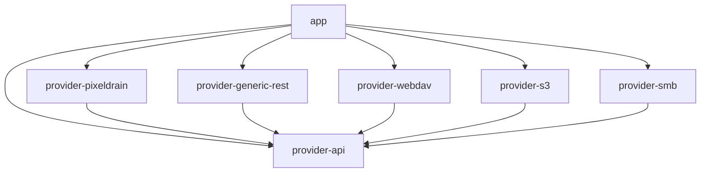
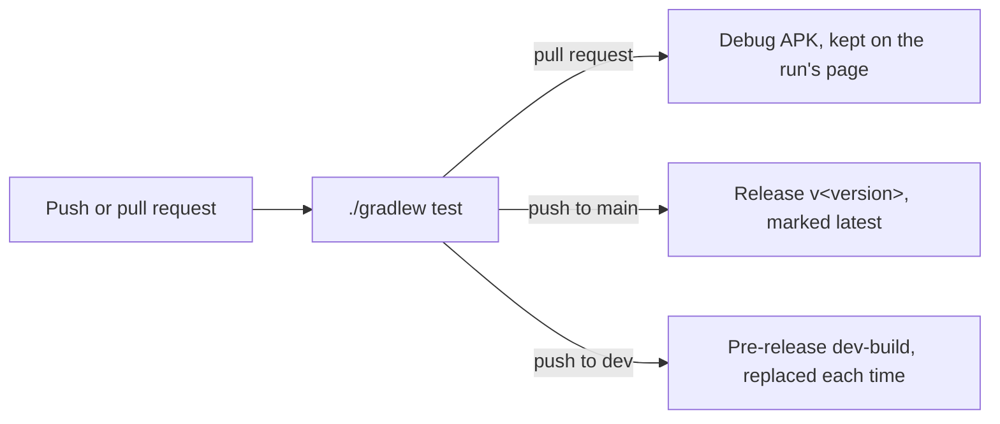

# Development

Materialdrain is a Kotlin app with a Jetpack Compose interface, split into an app module and one module per kind of
host. This page gets you from a fresh clone to a running build, and explains the branches, the build workflow and how
versions are made. The other pages in this section go into how the code works.

## What you need

| Tool | Version | Where it's set |
| --- | --- | --- |
| JDK | 17 (the build workflow uses Temurin 17) | `.github/workflows/build.yml` |
| Gradle | 9.8.0, through the wrapper: nothing to install | `gradle/wrapper/gradle-wrapper.properties` |
| Android Gradle Plugin | 9.4.1 | `gradle/libs.versions.toml` |
| Android SDK | Platform 37 (`compileSdk`) | `app/build.gradle.kts` and each module's `build.gradle.kts` |

The app runs on Android 10 and newer (`minSdk = 29`) and targets API 36 (`targetSdk = 36`). The code is compiled for
Java 11 (`sourceCompatibility`, `jvmTarget`), which a JDK 17 builds without anything extra.

Android Studio finds the SDK on its own. From the command line, point Gradle at it with `ANDROID_HOME` or a
`local.properties` file containing `sdk.dir=…`; `local.properties` is in `.gitignore`, so it stays on your machine.

## Getting the code

```bash
git clone https://github.com/fidesosu/Materialdrain.git
cd Materialdrain
git switch dev
```

### The branches

| Branch | What it holds |
| --- | --- |
| `main` | Stable releases. Every push to it publishes a release |
| `dev` | Development. Work happens here; every push publishes the `dev-build` pre-release |
| `website` | This documentation and the home page. It shares no history with the app's branches |
| `site` | The built website, made from `website` by its workflow. Never edited by hand: each build replaces it |

Changes to the app go to `dev` first, and reach `main` when they're ready to be a release. The documentation lives on
`website` so that editing it never starts an app build, and the app's branches hold only the app; see
[This website](website.md).

## Building

```bash
./gradlew assembleDebug
```

The APK lands in `app/build/outputs/apk/debug/app-debug.apk`; `./gradlew installDebug` puts it on a connected phone
or emulator. A debug build has the same `applicationId` as the releases, `tools.senko.materialdrain`, but is signed with
your machine's debug key, so Android won't install it over a release build: uninstall that first.

`./gradlew assembleRelease` needs the release key (see [Signing](#signing)), so locally you'll want the debug build.
The release build is minified and has unused resources removed (`isMinifyEnabled`, `isShrinkResources`), with the
rules in `app/proguard-rules.pro`.

## Testing

```bash
./gradlew test
```

The tests are plain JUnit 4 unit tests that run on your computer, with no phone or emulator.
`./gradlew :provider-s3:test` runs one module's.

| Module | What its tests cover |
| --- | --- |
| `app` | Sorting files, date parsing, text and code highlighting, the config editor's schema, the rolling-number animation's plan |
| `provider-api` | Reading and writing configs, why an import is refused, config updates, screens and templates, the bundled example configs, where the account login may go, zip listings |
| `provider-generic-rest` | Auth headers, dot-paths, the login flow, listing, and the bundled Pixeldrain config against a fake server |
| `provider-webdav` | Auth, media URLs, the XML answers, and the provider against a fake server |
| `provider-s3` | Request signing, the XML answers, and the provider against a fake server |
| `provider-smb` | Paths |
| `provider-pixeldrain` | No tests yet |

The HTTP hosts are tested against OkHttp's `MockWebServer`, so a test sends real requests to a server it controls.
More on how tests are written in [Conventions](conventions.md#tests).

## The modules



| Module | In one line |
| --- | --- |
| `app` | The Android app: screens, ViewModels, settings, transfers, previews, and the store of hosts |
| `provider-api` | What every host is to the app: the `StorageProvider` interface, its results, and the config format |
| `provider-pixeldrain` | The built-in Pixeldrain host, the one you sign into under **Account** |
| `provider-generic-rest` | Any REST API described by a config, including the bundled Pixeldrain config |
| `provider-webdav` | WebDAV servers, such as Nextcloud |
| `provider-s3` | S3 buckets, with its own request signing |
| `provider-smb` | SMB shares, through jcifs-ng |

The provider modules only know `provider-api`, never each other or the app. How they fit together is in
[Architecture](architecture.md).

## The build workflow

`.github/workflows/build.yml` tests and publishes the app. It runs on pushes and pull requests to `main` and `dev`,
but only when something that goes into the APK changed: `app/`, the `provider-*` modules, the example configs in
`docs/provider-configs/` (they're bundled as assets), the Gradle files and the wrapper. Markdown files never count.
**Run workflow** on the Actions tab runs it anyway.



| Event | What happens after the tests pass |
| --- | --- |
| Pull request | A debug APK is built and attached to the run. It never sees the signing key |
| Push to `main` | A signed release build is published as its own GitHub release, tagged `v<version>` and marked the latest. Its notes list the changes since the release before. Older releases stay |
| Push to `dev` | The same build with `-dev` added to its version, published as the one pre-release tagged `dev-build`. The tag moves to the new commit, and the APK of the build before is removed |

The APK is named `Materialdrain-<version>.apk`. The [home page](website.md#the-downloads) lists these releases.

A newer push to the same branch cancels a build that's still running.

### Signing

Release builds are signed with the release key, which lives in the repository's Actions secrets:

| Secret | What it is |
| --- | --- |
| `KEYSTORE_BASE64` | The keystore file, base64-encoded. The workflow decodes it to `materialdrain-release.jks` at the root |
| `KEYSTORE_PASSWORD` | The keystore's password |
| `KEY_PASSWORD` | The password of the key, whose alias is `materialdrain` |

`app/build.gradle.kts` reads the file and the two passwords (from environment variables of the same names). The
workflow fails with a clear message when `KEYSTORE_BASE64` isn't set, and deletes the key file at the end, even when
the build failed. `*.jks` files are in `.gitignore`.

## Versions

Nobody sets the version by hand. `app/build.gradle.kts` makes it from the time of the commit being built:

| | Made of | Example |
| --- | --- | --- |
| `versionName` | `1.4.`, then the commit's date and time in UTC as `yyyyMMdd.HHmm`, then `-dev` for builds of `dev` | `1.4.20261009.1530` |
| `versionCode` | The minutes from the start of 2025 (UTC) to the commit | `931170` |

- **Every newer commit gets a higher version code**, so a newer build always installs over an older one. That goes
  for stable and dev builds alike: they share the `applicationId`, so you can switch between them.
- **The commit's time, not the build's.** Building the same commit again gives the same version, so a rebuild on CI
  replaces the APK of its release instead of making a new one.
- **`1.4`** is `baseVersion`. Change it only for a big step.
- The `-dev` suffix comes from the `VERSION_SUFFIX` environment variable, which the workflow sets on `dev`.
- Without git (a source download, say), the current time is used instead.

The version code is also what a config's `min_app_version` compares against; see
[Sharing and updates](../hosts/sharing-and-updates.md#meta).

## Where to go next

- [Architecture](architecture.md): how the modules, the app's container and the screens fit together.
- [Hosts in code](providers.md): `StorageProvider`, capabilities, and how each kind of host is built.
- [The interface](interface.md): the screens, navigation and the Compose components they share.
- [Uploads and downloads](transfers.md): transfers, progress, cancelling, and the background service.
- [Thumbnails and previews](media.md): images, video, audio, text and archives.
- [Search and sorting](search-and-sorting.md): searching folders and ordering lists.
- [Data and security](data-and-security.md): what's stored where, and how sign-ins are encrypted.
- [Common tasks](common-tasks.md): recipes for the changes people make most.
- [Conventions](conventions.md): how the code is written, and why.
- [This website](website.md): how these pages and the home page are built and published.
