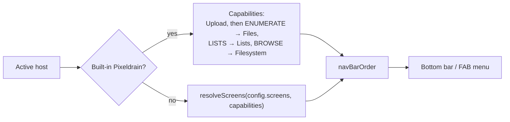

# The interface

The whole interface is Jetpack Compose with Material 3, in one activity. This page walks through it from the outside
in: the shell that holds the screens, the one browser screen behind three tabs, and the small design system every
screen is built from. Paths are under `app/src/main/java/tools/senko/materialdrain/` unless they say otherwise.

## The shell

`MainActivity` sets the content once. It turns off the overscroll stretch everywhere (`LocalOverscrollFactory provides
null`), wraps everything in `MaterialdrainTheme`, and puts the app lock over the app:

```kotlin
MaterialdrainTheme {
    Box(modifier = Modifier.fillMaxSize()) {
        MaterialdrainScreen()
        AppLockOverlay(this@MainActivity, AppContainer.get(application).appLock)
    }
}
```

`MaterialdrainScreen()` in `App.kt` is the shell. It owns the current screen, the ViewModels, the top bar, the bottom
bar, the FAB, the snackbars and the app-wide dialogs. There is no navigation library: the current screen is a
`rememberSaveable` value of the `Screen` enum (`Navigation.kt`), and `navigateTo` swaps it, remembering the previous one
for back.

| Piece | Where | What it does |
| --- | --- | --- |
| `Screen` | `Navigation.kt` | Every screen: `Upload`, `Files`, `Filesystem`, `FileDetail`, `Lists`, `Settings` |
| `HostScreen.toScreen()` | `Navigation.kt` | Maps provider-api's `HostScreen` to the app's `Screen`. The one place the two meet, as provider-api can't see the app module |
| `BottomNavigationBar` | `Navigation.kt` | A Material `NavigationBar` with one item per screen of `navBarOrder` |
| `FabDetails` | `Navigation.kt` | What the extended FAB shows for a screen: icon, text, action |
| `TransferBarSlot` | `App.kt` | The progress bar under the top bar (see [TransferStatusBar](#transferstatusbar)) |
| `lastScreen` | `settings/AppSettings.kt` | The screen the app was on, so it opens there again |

Screen changes animate with `AnimatedContent`: a vertical slide in tab order, or a quick crossfade with reduced motion
(see [Reduced motion](#reduced-motion-and-the-other-locals)).

### Tabs come from the host

Which tabs exist is decided by the active host, not by the app. `App.kt` works it out each time the configs change:



- **A config** picks its screens with `screens` (see [Screens](../hosts/config-format.md#screens)).
  `resolveScreens` in provider-api keeps them in the config's order and drops the ones the host can't back.
- **The built-in Pixeldrain host** isn't a config, so it gets Upload and then whatever its capabilities allow.
- **A screen's config entry** can rename the tab (`screenTitle`) and take capabilities away from it
  (`disabledCapabilities`, passed to `BrowserScreen`).
- **A screen the new host doesn't offer** falls back to the first one it does. This runs when the host changes and when
  the screen changes, since a host switched to from Settings only meets its tabs when you leave Settings.
- **No screens at all** (`"screens": []`, or only ones the host can't back) shows a message saying so instead of a
  screen.

### One screen hides the bar

With a single screen there is nothing to switch between, so the bar would only take space. The bottom bar is shown
only when `navBarOrder.size > 1` (and not on the file details). The same rule hides the navigation FAB.

Without the bottom bar, the file screens and the details are drawn down to the screen's edge, under the see-through
system navigation bar. `LocalBottomInset` tells the lists how much room to leave after their last item, so it can still
be scrolled clear of the bar.

### The navigation FAB menu

`navmenu/` holds a prototype: a round button in a bottom corner that opens a small window of destinations, instead of
the bottom bar. It's off by default and turned on in **Settings → Developer → FAB navigation prototype**
(`AppSettings.navPrototype`).

| File | What's in it |
| --- | --- |
| `NavFabMenu.kt` | `NavFabMenu` (the button, the dim, the window), `NavFab` (swipe sideways to move it), `NavMenuWindow` |
| `NavMenus.kt` | `NavMenu`, `NavMenuSection`, `NavMenuItem`, `NavFabPosition` (start, center, end), and the menus themselves |

- The window is bottom-anchored: a reversed `LazyColumn`, so the pinned row sits right above the button (and the
  thumb), and earlier sections are a scroll away.
- A swipe moves the button exactly one spot, only once the finger lifts, and only if it was released within
  `SWIPE_TIMEOUT_MILLIS` of starting to move. The spot is saved in `AppSettings.navFabPosition`.
- The window grows out of the button's corner; with reduced motion it only fades. On Android 12 and up the screen
  behind it is blurred (`navMenuBlur` in `App.kt`).
- **What it lists doesn't follow the host yet.** It shows the menu picked in **Developer → Preview navigation as**:
  `PixeldrainNavMenu` (Upload, Files, Lists, Filesystem) or `TrueNasMockNavMenu`, a mock with dozens of entries to see
  how the window copes. Mock items have no `screen` and only highlight when tapped. Picking a tab the host doesn't
  offer lands on its first screen, through the fallback above.

### The host switcher

On the browse screens (Upload, Files, Lists, Filesystem) the top bar has no title. `HostSwitcher`
(`hosts/HostSwitcher.kt`) sits in its place: a floating card with the active host's icon, a status badge and its name.
Tapping it opens an [`AppMenu`](#appmenu) of every host (`hostOptions`: the built-in Pixeldrain first, then the configs
in the order they were added), each with its address, whether it answers and whether it's signed in.

- Whether each host answers is known before the menu opens: `HostHealth` checks them every three minutes while the app
  is in front (`HOST_RECHECK_MILLIS`), when the configs change, and when the network changes. Opening the menu checks
  only hosts not checked in the last half minute; the header's refresh button checks all of them now.
- The badge shows the state with a symbol as well as a colour (tick, cross, question mark, crossed-out cloud), so it
  doesn't hang on colour alone.
- Choosing a host calls `ProviderConfigStore.setActive`. The gear, or **Sign in**, opens that host's settings;
  **Manage hosts** opens **Settings → Advanced**.

## BrowserScreen

`browser/BrowserScreen.kt` is the one screen behind the Files, Lists and Filesystem tabs. `App.kt` passes a
`BrowserMode`, and the mode decides what the screen lists and offers:

| `BrowserMode` | Lists | Above the list | Opening an entry |
| --- | --- | --- | --- |
| `FILES` | The account's files, flat (`FileInfoViewModel.displayedFiles`) | Sort row | Its details |
| `LISTS` | The lists as folders, one level deep; inside one, its files (`ListViewModel`) | Inside a list: sort row, the list's title, **All (ZIP)** | A list opens it; a file opens its details |
| `FILESYSTEM` | Folders and files (`FilesystemViewModel.displayedChildren`) | Sort row with **New**, the path | A folder goes into it; a file opens its details |

Everything that differs between the modes is a `when (mode)` near the top of the function: the entries, the loading
and error state, the refresh, the search candidates and the selection actions. The list itself, pull to refresh, the
empty and error states and the `DotScrollbar` are shared.

Details worth knowing before changing it:

- **The loading spinner waits.** Folders usually load within a fraction of a second, so it shows only after
  `LOADING_INDICATOR_DELAY_MS` (400 ms), or at once on a pull to refresh.
- **A refresh keeps the scroll position**, unless it turned up a file that wasn't listed before: then it jumps to the
  top, where the new file is.
- **Back** leaves the selection first, then the open list, then goes up a folder.
- **Scroll positions survive** visits to other screens: the `LazyListState`s live in `App.kt`, not in the screen.
- **Filesystem actions** (upload, new folder, import by id) are in the screen itself, not a FAB, so they work the same
  with the bottom bar and with the navigation prototype.

### The sort row

`SortControls` in `browser/BrowserControls.kt` is the row of floating cards above the list:

- **Sort by** opens an `AppMenu` with `SortOptions` (Name, Size, Date). Choosing the field already sorted on flips the
  direction (`AppSettings.changeSortOrder`). The menu stays open, so the effect can be seen and flipped again.
- **Cancel** appears while a transfer the bar above shows is running, and stops it.
- **New** holds the screen's `SortRowAction`s (on the Filesystem: *Upload*, *New folder*, *Import files by ID*, each
  where the host and the screen's config allow it) in its own `AppMenu`, lined up with the card's end.

The cards size themselves. `sortRowNeeds()` measures what each card needs to show all of itself, from its text as it's
drawn (with `rememberTextMeasurer`) plus its icons and padding. *Sort by* measures the longest field name, so it never
changes size between fields. Each shown card then gets a share of the row as big as its share of what they all need:

```kotlin
val visibleNeeds = needs.filterIndexed { i, _ -> shown[i] }
val room = maxWidth - SortRowGap * (visibleNeeds.size - 1)
val scale = room / visibleNeeds.fold(0.dp) { sum, need -> sum + need }
```

So *Sort by* alone fills the row, beside *New* they split it by content, and a *Cancel* appearing makes room for itself.
The widths animate with a spring, and on a narrow screen every card gives way alike, its text ending in "…".

### The selection bar

A long-press (or *Select* in an entry's menu) starts selecting. `BrowserScreen` keeps the selected keys, and
`SelectionActionBar` (`files/SelectionBar.kt`) is the bar at the bottom while selecting:

- It takes a list of `SelectionAction`s (label, icon, action, `enabled`, `destructive`). The first three
  (`ICON_ACTIONS`) are icons, the rest go into an `AppMenu` behind a ⋮.
- `SelectionBarHeight` (72 dp) is public so the FAB and the snackbar can rise by the same amount.
- Its colour runs on under the system navigation bar; its buttons stay above it (`LocalBottomInset`).
- Entries that disappear (deleted, moved, filtered out) are dropped from the selection.

Which actions there are is built per mode in `BrowserScreen`: download, move and delete on the Filesystem; download as
ZIP, add to a list, delete, add to the filesystem and remove from this list on Files and Lists. Each is left out when
the host or the screen's config doesn't allow it.

### File details

`FileInfoDetailsCard` in `files/FileDetailsScreen.kt` is the details page. From the top:

- **The preview**, chosen by `StorageNode.previewMimeType()`: an image, a video, a song, the colored start of a text
  file (`CodePreview`), or an archive's contents (`ArchiveContents`). See [Thumbnails and previews](media.md).
- **The header**: the whole name (selectable), with the tile of the file's kind when the preview doesn't already show
  its picture.
- **The actions**: the download button (tap twice to start, shows progress while it runs, opens the file when done),
  then share, copy link and delete.
- **The details**: size, type, dates, Pixeldrain's views and downloads (`StatsRow`), ids and links, each copyable.

The top bar's ⋮ on this screen is in `App.kt`, as an `AppMenu`.

## The design system

The shared look lives in `ui/components/`. Use these instead of a Material component with the same purpose, so a change
made in one place reaches every screen.

### FloatingCard

`FloatingCard.kt` is three tokens, not a composable:

| Token | Value | Why |
| --- | --- | --- |
| `FloatingCardShape` | `RoundedCornerShape(20.dp)` | The corners of every floating card |
| `floatingCardColor()` | `surfaceContainerHigh` at 72% alpha | Translucent, so what's behind (the blur, in the search) shows through |
| `floatingCardBorder()` | 0.5 dp, `outlineVariant` at 50% alpha | A hairline edge that keeps the card apart from what's behind it |

They're used by the sort row's cards (`FloatingCardButton` in `BrowserControls.kt`), the search result cards
(`SearchResults.kt`), the host switcher, and every `AppMenu` (shape and border; menus are opaque). Put them on a
`Surface`:

```kotlin
Surface(
    shape = FloatingCardShape,
    color = floatingCardColor(),
    border = floatingCardBorder(),
    contentColor = MaterialTheme.colorScheme.onSurface
) { /* … */ }
```

The navigation prototype's window and the file details' cards use their own values in the same spirit (24 dp and
94% alpha; `DetailCardShape` at 20 dp).

### AppMenu

`AppMenu.kt` is the app's one menu. The ⋮ menus of files, *Sort by*, *New*, the host switcher, the selection bar's
overflow, the video player's settings and the config editor's choices are all an `AppMenu` with `AppMenuItem`s. There
is no `DropdownMenu` in the app.

**Why every menu goes through it:** menus then look and behave alike, and a change made in `AppMenu.kt` reaches all of
them. What differs between two menus is a parameter, never a copy. A menu built some other way would drift from the rest
the next time the look changes.

| Part | What it is |
| --- | --- |
| `AppMenu` | The popup. A `BoxScope` extension: call it inside the `Box` that holds its button, and it takes its size and place from that box |
| `AppMenuDefaults` | Every measure: `Gap`, `ScreenMargin`, `MinWidth` (168 dp), `MaxWidth` (400 dp), `MAX_HEIGHT_FRACTION` (0.6), `ItemHeight`, `ItemShape`, `ShadowRoom`, `ANIMATION_MS` (200) |
| `MenuSide` | `Below`, `Above` or `Auto` (below, unless it only fits above) |
| `MenuEdge` | Which edge of the button it lines up with: `Start`, `Center`, `End` or `Auto` (start, or end for a button in the end half of the screen) |
| `AppMenuItem` | An entry: `text`, optional `leadingIcon`, `supportingText`, `trailingText`, `trailingIcon`. `active` marks the current choice in the accent colour; `destructive` is in the error colour; `enabled` |
| `AppMenuDivider` | A hairline between groups, e.g. before a destructive entry |
| `AppMenuPages` | Two levels in one menu: `secondary` entries replace `primary` ones while `showSecondary` is true, sliding sideways |
| `OverflowMenuButton` | The usual ⋮ button with its menu. Its content gets `close` |

How it behaves:

- It's as wide as its widest entry, between `minWidth` and `maxWidth`, and never wider than the screen. With
  `matchAnchorWidth` it's at least as wide as its button (the sort row's menus use this).
- Taller than `maxHeight` (by default 60% of the screen) it scrolls. Long entries end in an ellipsis.
- It's kept on screen, and grows out of the side of the menu its button is on. With reduced motion it appears at once.
- A tap outside or back calls `onDismiss`. **Choosing an entry doesn't close it**: that's up to the entry, so a choice
  like a sort order can stay open to show its effect.

The usual ⋮ menu, from `FilesystemMenu` in `BrowserScreen.kt`:

```kotlin
OverflowMenuButton(contentDescription = "More options for ${node.name}") { close ->
    AppMenuItem("Rename", leadingIcon = Icons.Filled.Edit, onClick = { close(); onRename() })
    AppMenuItem("Select", leadingIcon = Icons.Filled.CheckBox, onClick = { close(); onSelect() })
    if (canDelete) {
        AppMenuDivider()
        AppMenuItem("Delete", leadingIcon = Icons.Filled.Delete, destructive = true, onClick = { close(); onDelete() })
    }
}
```

A menu on a button of your own, from the *New* card in `BrowserControls.kt`:

```kotlin
Box(modifier = modifier) {
    FloatingCardButton(onClick = { expanded = true }) { /* the card */ }
    AppMenu(expanded = expanded, onDismiss = { expanded = false },
        side = MenuSide.Below, edge = MenuEdge.End, matchAnchorWidth = true) {
        actions.forEach { action ->
            AppMenuItem(action.description, leadingIcon = action.icon, enabled = action.enabled,
                onClick = { expanded = false; action.onClick() })
        }
    }
}
```

The `Box` should hold only the button: the menu measures that box to place itself. `VideoSettingsMenu` in
`ui/media/VideoPlayer.kt` shows `AppMenuPages` (Loop and Speed, with the speeds on a second page).

### FileListItem and FileIcon

`FileListItem.kt` has the row of a file or folder, and the picture used wherever a file is shown.

- **`FileListItem`** is a plain `Row`, not a Material `ListItem`, whose trailing area reserves far more width than the
  small menu button needs and takes it from the name. It shows the icon, the name, a details line (`fileDetails`: size,
  extension in capitals, date) and a trailing slot. While selecting, the trailing slot becomes a checkbox.
- **`FileIcon`** is a soft tile in the colour of the file's kind with a glyph, and the thumbnail over it when there is
  one. The kind comes from the extension (`FileKind`: folder, image, video, audio, archive, PDF, code, document, app,
  other), and its colours from the theme, so they follow dynamic colour and dark mode.
- **Thumbnails** load with Coil's `AsyncImage`, decoded at the tile's size rather than the original's, and fade in over
  the tile. There's no placeholder or error picture: the tile underneath is both. The request is remembered per URL and
  login, as a new request on every recomposition would load it again. The sign-in headers come from
  `HostRequestAuth.headersFor`; see [Thumbnails and previews](media.md) for where thumbnail URLs come from.

`fileKindLabel` and `fileDetails` are shared with the search result cards, so a match reads like its row.

### Dialogs

`Dialogs.kt` has the app's three dialogs:

| Dialog | For |
| --- | --- |
| `TextInputDialog` | One text field (new folder, rename, import by id). Confirm is off while the text is blank |
| `ConfirmDialog` | A yes or no; `isDestructive` makes the confirm button the error colour |
| `FolderPickerDialog` | Browsing to a folder (move). A fixed-height list, so the dialog never changes size; each listing is kept while it's open; back goes up a folder before it closes |

### SharedSnackbar

`AppSnackbarHost` in `SharedSnackbar.kt` replaces Material's `SnackbarHost`. It shows and hides the snackbar itself so
it can animate in and out, keeps the last message while that one leaves, and grows upward. With `styled` (the
navigation prototype) it takes the navigation button's look and, when the button sits at an edge, shares its row.
`snackbarMotion(reduceMotion)` is the one motion for the snackbar and for the buttons that lift above it, so they move
together; it's instant with reduced motion.

### DotScrollbar

`DotScrollbar` is a small dot at the right edge showing where a list is. Dragging it scrolls and stretches it into a
line; letting go stops the content dead. Only the dot and a little around it take touches, so rows beside it stay
clickable. It has two overloads, for a `LazyListState` and for a `ScrollState`, and is a `BoxScope` extension: put it in
the `Box` around the list.

### OdometerText

`OdometerText` rolls each changed character to the new one like an odometer wheel, along the alphabet, the digits or
the code table. Use it only where the same text element changes its text (the Save Settings button, a stat on the file
details). `fixedWidth` with `widthReferenceTexts` reserves the width of the widest text, so the container never changes
size. It doesn't animate with reduced motion (`animate = !LocalReduceMotion.current`). The timing lives in
`OdometerSpec`.

### TransferStatusBar

`TransferStatusBar` draws a `TransferProgress` (bytes, total, speed, time left, a label) as the bar under the top bar.
The percentage has a fixed-width slot, so a change of digits never moves the other texts. `TransferBarSlot` in `App.kt`
picks what it shows for the current screen, and reads the transfer state itself, so a progress tick recomposes only the
bar and not the whole screen. See [Uploads and downloads](transfers.md).

## Reduced motion and the other locals

`ui/LocalSettings.kt` holds the settings that composables deep in the tree need, as `CompositionLocal`s. Each is
provided once, in `App.kt`:

| Local | Default | What it is |
| --- | --- | --- |
| `LocalReduceMotion` | `false` | Whether animations are reduced |
| `LocalBlurredBackdrop` | `true` | Whether previews show the file's thumbnail, blurred, as a backdrop |
| `LocalTextWrap` | `true` | Whether long lines of a text preview wrap or scroll sideways |
| `LocalBottomInset` | `0.dp` | How far the system navigation bar reaches over the content, while the app's bottom bar is hidden |
| `LocalVideoLoop` | off | `VideoLoopSetting`: whether videos loop, and how to change it |

`LocalReduceMotion` is on when the user turned on **Settings → Accessibility → Reduce animations**, *or* when animations
are off in the Android settings (`AppSettings.systemAnimationsDisabled()`, the animator duration scale is 0).

**Why every animation must respect it:** people turn animations off because motion makes them unwell, distracts them, or
because their device is slow. The rule, from `LocalSettings.kt`: decorative motion is left out (sliding, scaling,
spinning, growing, rolling text and animated scrolling); fades and changes that give feedback, like a transfer's
progress, stay. Read it wherever something moves, and give the reduced case a short fade or nothing:

```kotlin
val reduceMotion = LocalReduceMotion.current
AnimatedVisibility(
    visible = visible,
    enter = if (reduceMotion) fadeIn(tween(100)) else slideInVertically(tween(200)) { it } + fadeIn(tween(200)),
    exit = if (reduceMotion) fadeOut(tween(100)) else slideOutVertically(tween(200)) { it } + fadeOut(tween(150))
)
```

The shared components already do this (`AppMenu`, `AppMenuPages`, `OdometerText`, `SelectionActionBar`,
`snackbarMotion`), so building from them gets it for free.

## The theme

`ui/theme/Theme.kt` has `MaterialdrainTheme`. On Android 12 and newer it uses dynamic colour (the colours of the
wallpaper, `dynamicDarkColorScheme` / `dynamicLightColorScheme`); before that, a fixed purple scheme from `Color.kt`.
Dark or light follows the system (`isSystemInDarkTheme()`). `Type.kt` sets `bodyLarge` and keeps Material's other text
styles.

Take colours from `MaterialTheme.colorScheme`, never as fixed values: then a screen follows the wallpaper and dark mode
like the rest. The file tiles, the selection bar (`secondaryContainer`) and the menus' highlights all do.

## The app lock

`AppLockOverlay` (`auth/AppLockOverlay.kt`) covers the app and takes every touch while it's locked, asking for the
fingerprint, face or screen lock straight away; see [Data and security](data-and-security.md).
