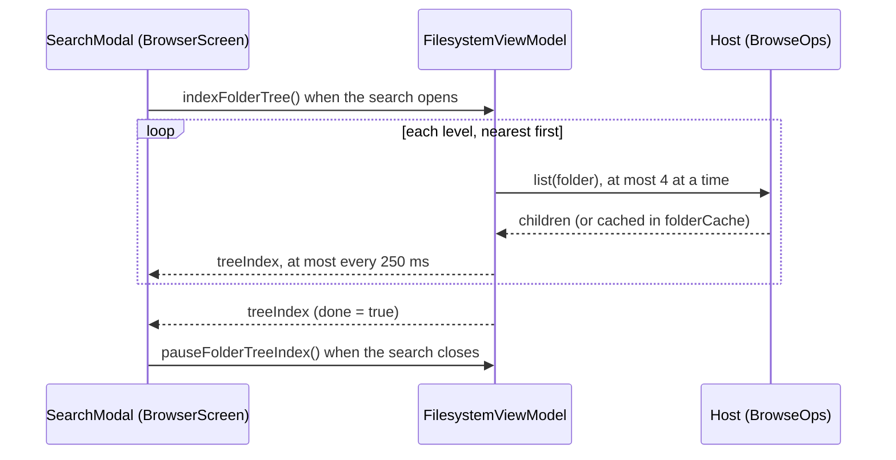

# Search and sorting

Both work on lists that can hold tens of thousands of files: a Pixeldrain account, or a folder tree searched all the
way down. This page explains how the order is kept fast, and how the search finds, shows and animates its matches
without slowing the screen down. Paths are under `app/src/main/java/tools/senko/materialdrain/`.

## Sorting

### One order for every list

There is one sort order in the app, not one per screen. `AppSettings.sortField` and `AppSettings.sortAscending` are
shared by the Files screen, the Filesystem screen, the files of an open list, and the search. They're saved, so the
order is kept across restarts, like a standing preference. The default is by name, ascending.

| `SortableField` | Label | Sorted by |
| --- | --- | --- |
| `NAME` | Name | The name, lowercased |
| `SIZE` | Size | The size in bytes; a file without one counts as 0 |
| `UPLOAD_DATE` | Date | `listDate` as a moment in time; a file without a date that can be read comes first ascending |

`SortOptions` in `files/FileSort.kt` holds the labels and the order they're offered in, wherever a sort menu is shown.
`AppSettings.changeSortOrder(field)` is what the menu calls: choosing the field already sorted on flips the direction,
choosing another one starts it ascending.

The lists overview (the Lists tab before a list is opened) isn't sortable: it's just titles, sorted by title.

### Which date

`StorageNode.listDate` is the date a file is listed and sorted by:

```kotlin
val StorageNode.listDate: String? get() = modifiedAt ?: createdAt
```

When it was last modified, where the host knows (SMB, WebDAV, S3, Pixeldrain's filesystem); otherwise when it was
uploaded. Pixeldrain's own files never change, so for them it's the upload date: the built-in provider sets
`createdAt` from `date_upload`, and the bundled Pixeldrain config maps `created` to `$.date_upload` in its `list`
endpoint (version 7 of that config changed it from the last time a file was viewed).

### Folders first

`fileComparator(field, ascending, directoriesFirst)` builds the comparator. With `directoriesFirst`, folders always come
before files and the field only orders within each group, so a file browser never mixes the two kinds of row. The
Filesystem screen and its search pass `true`; Files and lists have no folders and pass nothing.

```kotlin
return if (directoriesFirst) compareBy<StorageNode> { !it.isDirectory }.then(byField) else byField
```

### Keeping it fast

A sort compares each file many times, so anything worked out per comparison is paid over and over. Three things keep
that cost down.

**Each file's key is worked out once.** `fileComparator` keeps a map of keys for as long as the comparator lives:

```kotlin
// Each file's key is worked out once, not at every comparison: a sort compares each file many times, and a date has
// to be read from its text first. Kept for as long as the comparator is, by the file itself (not its equality, which
// would hash every field of it); synchronized, as a search may still be sorting when the next one starts
val keys = Collections.synchronizedMap(IdentityHashMap<StorageNode, Comparable<*>>())
val byField = compareBy<StorageNode> { node -> keys.getOrPut(node) { node.sortKey(field) } }
```

- It's an `IdentityHashMap`: `StorageNode` is a data class, and hashing by equality would hash every field of it.
- It's synchronized, because the search remembers its comparator and may still be sorting with it when the next
  search starts.
- The search keeps the same comparator while the sort order stays the same
  (`remember(sortField, sortAscending) { fileComparator(…) }`), so as matches come in and the query changes, a file's
  key is still read only once.

**A date is read by its shape.** `parseDateTime` in `util/DateParsing.kt` reads ISO 8601 (with or without a zone) and
RFC 1123 (WebDAV). It tells which one a text is by looking at it (RFC 1123 starts with the day's name, a zone is a `Z` or
an offset after the time), so each date is parsed once, by the one format it can be. Trying formats in turn until one
didn't throw made sorting a big folder by date slow. The key is the moment, not the text: hosts write dates differently,
and RFC 1123 doesn't sort as text.

**Sorting is off the main thread.** The ViewModels sort in a `combine` of the list, the filter and the two sort
settings, on `Dispatchers.Default`, and publish the result:

| ViewModel | Publishes | Sorted with |
| --- | --- | --- |
| `FileInfoViewModel` | `displayedFiles` | `fileComparator(sortField, sortAscending)` |
| `ListViewModel` | `displayedListFiles` | `fileComparator(sortField, sortAscending)` |
| `FilesystemViewModel` | `displayedChildren` | `fileComparator(sortField, sortAscending, directoriesFirst = true)` |

`FilesystemUiState.visibleChildren` (the folder without the hidden `.search_index.gz`) is a `by lazy` value, worked out
once per state: a new list on every recomposition would restart everything that depends on it.

The tests are in `app/src/test/…/files/FileSortTest.kt` (dates in every host's format, folders first, a comparator used
twice) and `util/ParseDateTimeTest.kt`.

## Search

The magnifier at the top left opens the search. `App.kt` shows it only where there's a list of files to search: Files,
Filesystem, and Lists with a list open (the lists overview is just titles). `BrowserScreen` then shows a `SearchModal`
with what that mode can match:

| Mode | Candidates | Order | Placeholder |
| --- | --- | --- | --- |
| Files | Every file of the account (`userFilesList`) | `fileComparator(sortField, sortAscending)` | *Search your files* |
| Lists | Every file of the open list (`listFiles`) | `fileComparator(sortField, sortAscending)` | *Search* + the list's title |
| Filesystem | The open folder and every folder under it (the [tree index](#searching-the-folder-tree)) | folders first | *Search this folder and its subfolders* |

### The search modal

`SearchModal` in `browser/BrowserControls.kt` is a compact search card near the top of the screen, with the matches
floating under it as cards of their own.

- **It never filters the list.** The list behind stays as it was; the matches are separate. Closing the search, tapping
  a match or pressing the search key leaves the list untouched. The screen keeps the last query
  (`rememberSaveable(mode)` in `BrowserScreen`), so reopening the search shows it again.
- **The search key only hides the keyboard**, leaving more room for the matches. Back, or a tap beside the cards, closes
  the search. Tapping a match closes it and opens the match.
- **Its own window.** It's a `Dialog`, so it stays sharp while `App.kt` blurs the screen behind it (Android 12 and up,
  `SEARCH_BLUR_RADIUS`, eased in). The dialog's own dim is lightened to `BLURRED_DIM_AMOUNT` (0.25) so it doesn't hide
  the blur; before Android 12, the dim is all there is.
- **Matching** is the name containing the query, ignoring case, then sorted by the list's own order. It runs on
  `Dispatchers.Default` in a `LaunchedEffect` keyed on the candidates, the query and the order, so a new keystroke (or
  new candidates from the tree) cancels the matching in progress and starts again:

    ```kotlin
    LaunchedEffect(candidates, fieldValue.text, order) {
        val text = fieldValue.text
        matches = if (text.isBlank()) emptyList() else withContext(Dispatchers.Default) {
            candidates.filter { it.name.contains(text, ignoreCase = true) }.sortedWith(order)
        }
    }
    ```

- **Under the query**, a line says *Showing N of M*, and the `status` line, if any (see below).
- **Where a match is.** On the Filesystem, `locationOf` gives a match's folder relative to where the search was opened;
  its card says *in Photos/2024*. A match right in the open folder has none.

### The result limit

All matches are shown by default. **Settings → Search → Most results shown** sets a limit for slower devices:
`AppSettings.searchResultLimit`, one of `SEARCH_RESULT_LIMITS` (`0`, `200`, `50`, `20`; `0` is no limit), chosen with
the radio buttons of `SearchResultLimitSection` in `preferences/SearchSettings.kt`.

With a limit, `SearchModal` shows the first that many matches (`matches.take(resultLimit)`) and counts the rest in a
pill under them: *+N more matches*. The matching and sorting still cover every candidate, so the ones shown are the
first in the list's order.

Why a limit at all, when only the cards on screen are drawn: each match still costs a little, and a search through a big
folder tree can match thousands of files.

### Filter chips

There are none. An earlier version filtered the list live and showed the query as a chip beside *Sort by*; once the
search stopped filtering the list, the chip had nothing to show and was removed. The ViewModels still carry a
`filterQuery` (and filter their displayed list by it, and the empty state mentions it), but nothing in the interface sets
it now.

### SearchResultStack

`SearchResultStack` in `browser/SearchResults.kt` draws the matches: separate translucent
[floating cards](interface.md#floatingcard) over the blurred screen, scrolling when there are more than fit.

**Every card is the same height.** `SearchResultHeight` is 60 dp and `SearchResultGap` 8 dp, so a card's place follows
from its index alone (`index * pitch`), and the whole stack's height from the count (`stackHeight`). Nothing has to be
measured to know where card 4,000 is.

**Only cards near the visible part exist.** The stack is a `verticalScroll` around a `Box` as tall as all the cards.
From the scroll position it works out which indexes are in view, plus `OffscreenMargin` (240 dp) either side so a quick
scroll doesn't show cards popping in, and composes only those:

```kotlin
val first = ((scroll.value - marginPx) / pitchPx).toInt().coerceIn(0, results.lastIndex)
val last = ((scroll.value + viewportPx + marginPx) / pitchPx).toInt().coerceIn(first, results.lastIndex)
for (index in first..last) { /* the card of results[index], keyed by the file */ }
```

So thousands of matches stay smooth, which is why the limit setting is off by default.

**Cards come and go.** Each card has a `ResultSlot`, kept by the file's key, with its own `presence` (0 gone, 1 full
size) and `y` animations:

- A card made within `ENTER_WINDOW_MILLIS` (400 ms) of the results changing is a new match: it grows into its place on a
  slightly springy `EnterSpring`. One made later was scrolled to, and appears at full size.
- A card that stops matching, while it's on screen, shrinks away where it was (`LEAVE_MILLIS`, 180 ms), drawn beneath the
  others (`zIndex` 0), while the rest glide to their new places over it (`PlacementSpring`). One that stops matching
  while scrolled away is simply forgotten.
- A card that's made again after being scrolled away appears right in its place, without gliding from where it once was.
- The stack's height animates with a spring, so whatever is under it (the *+N more matches* pill) moves smoothly too.
  The stack isn't clipped inside, so a card shrinking below the new, smaller height stays until it's gone.
- When a card has finished leaving, a counter (`removals`) is bumped so the stack composes again without it.

**Why not a `LazyColumn`.** The code doesn't say it in one line, but the requirements above rule it out: a lazy list
drops an item as soon as it leaves the data, while here a card that no longer matches has to stay, beneath the others,
at its old place, until it has shrunk away. Doing the lazy part by hand is cheap because every card has the same height:
the visible range is two divisions, and each card is placed by an offset rather than by layout.

### Searching the folder tree

On the Filesystem screen the search looks through the open folder and every folder under it.
`FilesystemViewModel.indexFolderTree()` lists the tree in the background into `treeIndex`, a `FolderTreeIndex`
(`root`, `nodes`, `foldersScanned`, `foldersFailed`, `done`), and the search matches against whatever it has found so
far.



How it walks:

- **Level by level, nearest first.** It lists the open folder, then every folder found in it, then every folder found in
  those, so matches close to where you are come in first.
- **A few at a time.** `TREE_INDEX_PARALLEL_LISTINGS` (4) listings run at once, through a `Semaphore`: quick, without
  flooding the host.
- **Each folder once.** A `visited` set keeps a folder reachable twice (a link back up the tree) from being listed again.
- **Hidden files stay hidden.** With **Hide .search_index.gz** on, Pixeldrain's search index is left out here too.
- **Failures are counted, not fatal.** A folder that can't be listed adds to `foldersFailed`, and the walk goes on.
- **It publishes as it goes**, at most every `TREE_INDEX_PUBLISH_MS` (250 ms): often enough to feel live, not so often
  that copying a big list each time adds up.

There's no limit on depth or on the number of files: it walks the whole tree. What limits it is the parallelism above,
and the result limit only limits what's shown.

While it runs, the modal's status line says *Looking through subfolders… N so far*; when some folders failed,
*N folders couldn't be opened*. Until the first of the tree arrives, the search matches the open folder itself.

**Caching.** Every listing goes into `folderCache`, by path. A search opened again, or from a folder already crawled,
reuses those listings instead of listing everything again, so searching again is instant. The cache is of the active
host only.

**Cancellation and invalidation:**

| What happens | Call | Effect |
| --- | --- | --- |
| The search closes | `pauseFolderTreeIndex()` (from the modal's `DisposableEffect`) | A walk still running is cancelled and `treeIndex` cleared, but the cache stays: the next search of the folder starts over quickly from it. A finished index is kept |
| The search opens again in the same folder | `indexFolderTree()` | Returns at once when the index for that folder is done or still running |
| The search opens in another folder | `indexFolderTree()` | Cancels the old walk and starts a new one, taking listings from the cache where it can |
| A refresh, an edit (new folder, rename, move, delete, import), an upload ending, another host | `forgetFolderTree()` | Cancels the walk and drops the index and the whole cache, as anything may have changed on the host |

All of it runs in `viewModelScope`, so it also stops with the ViewModel.
