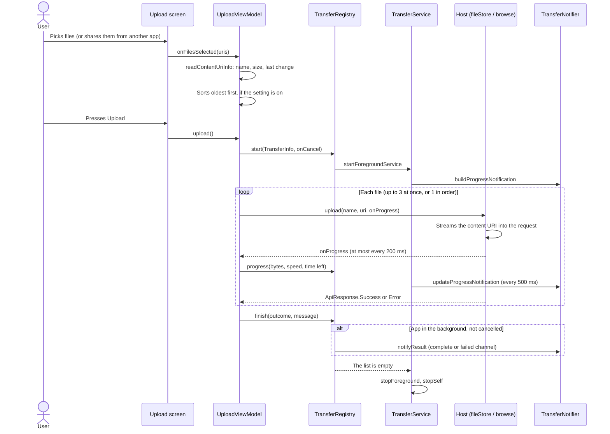

# Uploads and downloads

Every upload and download runs in a ViewModel, the same way for every host. Next to them sits a small `transfer`
package that knows nothing about hosts: it keeps a list of what's running, keeps the app alive while something runs,
and shows the notifications. This page goes through both halves.

All paths below are under `app/src/main/java/tools/senko/materialdrain/`, except the `provider-*` modules.

## The pieces

| Piece | File | What it does |
| --- | --- | --- |
| `TransferRegistry` | `transfer/TransferRegistry.kt` | The process-wide list of running transfers. ViewModels report to it |
| `TransferService` | `transfer/TransferService.kt` | A foreground service that runs while the list isn't empty, with the progress notification |
| `TransferNotifier` | `transfer/TransferNotifier.kt` | Builds the notifications and their channels |
| `TransferSpeedTracker` | `transfer/TransferSpeedTracker.kt` | A smoothed speed, and with `estimateEtaSeconds` the time left |
| `ProgressThrottle` | `provider-api/…/ProgressThrottle.kt` | Lets a host's copy loop report progress at most every 200 ms |
| `UploadViewModel` | `upload/UploadViewModel.kt` | The Upload screen: one file, typed text, or a queue of files |
| `FilesystemViewModel` | `filesystem/FilesystemViewModel.kt` | Uploads into the open folder of the Filesystem screen |
| `FileInfoViewModel` | `files/FileInfoViewModel.kt` | Downloads: one file, several, or several as a zip |

The three ViewModels that run transfers don't belong to the activity. `App.kt` creates them with
`AppContainer.transferViewModelStoreOwner`, an owner tied to the process, so closing the activity doesn't cancel the
coroutines in their `viewModelScope`:

```kotlin
// The ViewModels which own uploads/downloads outlive the activity, so transfers continue in the background
val transferOwner = appContainer.transferViewModelStoreOwner
val uploadViewModel: UploadViewModel = viewModel(viewModelStoreOwner = transferOwner, factory = viewModelFactory)
```

## The registry

`TransferRegistry` holds a `StateFlow<Map<String, TransferInfo>>`. A `TransferInfo` is an id, a kind (`UPLOAD` or
`DOWNLOAD`), a title (a file name, or "3 files" for a batch), and the bytes, speed and time left. A ViewModel calls:

| Call | When |
| --- | --- |
| `start(info, onCancel)` | Before the work begins. It also starts `TransferService` |
| `progress(id, …)` | From the progress callback, with the bytes so far, the speed and the time left |
| `finish(id, outcome, message, openUri, mimeType)` | Once, in a `finally`, with `COMPLETED`, `FAILED` or `CANCELLED` |

`onCancel` is how the notification's **Cancel** button reaches a transfer: the registry keeps each handler and
`cancelAll()` calls them. A handler normally just cancels the ViewModel's job.

`finish` shows a result notification only when the outcome isn't `CANCELLED` and the app isn't in the foreground.
`MainActivity` sets `appInForeground` in `onStart` and `onStop`. If you're looking at the app, the screen already says
how it went; a notification would only repeat it.

## The foreground service

`TransferService` doesn't move any bytes. It's there for two reasons:

- **To keep the process alive.** A background app can be killed at any time. A foreground service tells Android the
  app is doing something the user asked for.
- **To show progress** in one ongoing notification that sums up every running transfer.

It's declared in the manifest with `android:foregroundServiceType="dataSync"`, the type Android has for moving data to
and from a server, and the app asks for `FOREGROUND_SERVICE_DATA_SYNC`.

**When it starts.** `TransferRegistry.start` calls `TransferService.start`, which calls `startForegroundService`. Every
such call has to be answered with `startForeground` quickly, so `onStartCommand` does that first. If Android doesn't
allow the start (for example, from the background), the error is logged and the transfer goes on without the
notification.

**While it runs.** It collects the registry's flow and updates the notification, then waits 500 ms
(`NOTIFICATION_UPDATE_INTERVAL_MS`) before it takes the next value. A notification updated faster than that only costs
battery.

**When it stops.** As soon as the registry is empty, it removes the notification and calls `stopSelf(latestStartId)`.
Passing the id of the latest start request means a transfer that started a moment ago keeps the service running.

**Android 15's time limit.** Android 15 allows a `dataSync` service only a few hours a day. When the limit is reached,
the system calls `onTimeout`, and the service stops itself. The transfers carry on as long as the process lives.

## Notifications

`TransferNotifier.ensureChannels()` creates three channels in one group, "Transfers". There are three so you can tune
each one in Android's settings: silence the progress, but keep a sound for failures.

| Channel id | Name | Importance | For |
| --- | --- | --- | --- |
| `transfer_progress` | Transfer progress | Low | The ongoing notification while files go up or down. Silent, no badge |
| `transfer_complete` | Completed transfers | Default | A transfer that finished while the app was in the background |
| `transfer_failed` | Failed transfers | High | A transfer that failed while the app was in the background |

The progress notification has one id (`PROGRESS_NOTIFICATION_ID = 1`) and sums up everything: "Uploading photo.jpg",
"Downloading 3 items" or "4 transfers running", then a percentage, the sizes, the speed and the time left. It only
shows a percentage when every transfer knows its size; otherwise the bar is indeterminate. Tapping it opens the app;
**Cancel** sends `ACTION_CANCEL_ALL_TRANSFERS` to the service, which calls `registry.cancelAll()`.

Result notifications each get a new id from 100 up, so they don't replace each other. A finished download's
notification opens the file itself (`ACTION_VIEW` with the saved URI), the same as the **Open** button in the app.

Without the `POST_NOTIFICATIONS` permission (Android 13 and later), `notify` does nothing. The foreground service
still keeps the transfer alive; it just runs silently.

## Speed and progress

### Throttled progress

A host's copy loop moves a file in small pieces: in the HTTP clients, each read gives at most one 8 KB Okio segment.
On a fast connection, that's over a thousand pieces per second, and every progress report updates the screen state
and the notification. `ProgressThrottle` passes on at most one report every
200 ms, which is plenty to look smooth. `finish` always reports, so the last value is never lost.

```kotlin
class ProgressThrottle(private val report: (Long) -> Unit) {
    private var lastReportNanos = 0L

    fun update(bytes: Long) {
        val now = System.nanoTime()
        if (now - lastReportNanos >= PROGRESS_REPORT_INTERVAL_NANOS) {
            lastReportNanos = now
            report(bytes)
        }
    }

    fun finish(bytes: Long) = report(bytes)
}
```

The hosts' HTTP and SMB clients use it inside their streaming loops (for example `StreamingRequestBody` in
`provider-pixeldrain`), so the ViewModels don't need to throttle anything themselves.

### Smoothed speed

`TransferSpeedTracker.update(totalBytes)` takes a new sample at most every 400 ms and keeps an exponential moving
average with a factor of 0.3. A raw bytes-per-second number jumps around too much to read. `estimateEtaSeconds` is the
bytes left divided by that speed, or `null` when the total or the speed isn't known.

## Uploads

### Picking files

There are two places to upload from:

- **The Upload screen** (`UploadViewModel`). One file shows a preview (its text, a song's details and cover, a video
  frame, a PDF's page count, an APK's icon). Several files make a queue of `UploadItem`s. Typed text is written to a
  temporary file in the cache, uploaded, and deleted again. A host without flat storage (WebDAV, S3, SMB) gets the
  upload in the top folder of the host (its `rootPath`) through `browse.upload`.
- **The Filesystem screen** (`FilesystemViewModel.onFilesPickedForUpload`). Files go into the open folder. If a name
  already exists there, the upload waits in `pendingUpload` until you confirm overwriting.

Both read each file's name, size and last-modified time with `readContentUriInfo` (`util/ContentUriInfo.kt`), without
opening the file. The bytes themselves are read later by the host, which streams them with
`contentResolver.openInputStream(uri)` straight into the request.

### The last-modified time

Android has no single way to ask when a shared file was last changed. `readLastModified` tries, in order:

1. `DocumentsContract.Document.COLUMN_LAST_MODIFIED`, for files from the system file picker.
2. `MediaStore.MediaColumns.DATE_MODIFIED` (in seconds), for the device's own media.
3. The opened file itself, with `Os.fstat`, for apps that share a file but answer neither question (a gallery, Google
   Photos). Only a regular file counts: a pipe that an app writes as it's read has no date of its own.

Each column is asked for in a query of its own, because some providers refuse a whole query when they don't know one
of its columns. A `file://` URI reads `File.lastModified()` directly.

### Order and parallelism

The setting **Settings → Uploads → Upload in the order the files were changed** (`AppSettings.uploadInModifiedOrder`,
off by default) decides how a queue goes up.

| Setting | Upload screen | Filesystem screen |
| --- | --- | --- |
| Off | Up to 3 files at once (`MAX_PARALLEL_UPLOADS`), in the order they were picked | One after another, as picked |
| On | One at a time, oldest first | One at a time, oldest first |

Why "oldest first"? Many hosts sort by upload date, newest on top. If the files go up in the order they were changed,
one after another, the newest file arrives last and ends up on top, just as it is on the phone. Running them in
parallel would mix up the arrival order, so the setting also turns parallelism off. That's slower for many small files,
which is why it's off by default.

The sort is in `inModifiedOrder`. Files without a known date go last, in the order they were picked:

```kotlin
internal fun inModifiedOrder(items: List<UploadItem>): List<UploadItem> =
    items.sortedBy { it.lastModifiedMillis ?: Long.MAX_VALUE }
```

The queue is sorted as soon as the files are picked, so you see the order before you press **Upload**. On the Upload
screen, a `Semaphore(parallelUploads)` limits how many of the `async` uploads run at once. The whole batch is one
transfer in the registry, so one notification shows its total.

### Files shared from another app

`MainActivity` has an intent filter for `ACTION_SEND` and `ACTION_SEND_MULTIPLE` with any MIME type. `handleShare`
takes the `EXTRA_STREAM` URIs and puts them in `AppContainer.pendingShares`. It's called from `onCreate` (only when
`savedInstanceState == null`, so rotating the screen doesn't upload the same files again) and from `onNewIntent`, since
the activity is `singleTop`.

`App.kt` watches that flow. When files are waiting and the app isn't locked, it opens the Upload screen, hands the
files to `uploadViewModel.onFilesSelected`, and empties the flow:

```kotlin
// A share waits for the unlock: nothing uploads while the app is locked
LaunchedEffect(pendingShares, appLocked) {
    if (pendingShares.isNotEmpty() && !appLocked) {
        navigateTo(Screen.Upload)
        uploadViewModel.onFilesSelected(pendingShares, context)
        appContainer.pendingShares.value = emptyList()
    }
}
```

The shared files are queued, not uploaded right away. You still press **Upload**, with the active host.

### Cancelling

Cancelling has to stop a transfer that's deep inside a host's blocking copy loop, in code that doesn't know about
coroutines. It works in three steps.

**1. The progress callback throws.** The callback runs inside the host's loop. It checks the job first:

```kotlin
val response = uploadFile(item.name, item.uri) { sent, _ ->
    // Called from inside the host's sending loop: a cancelled upload stops there
    if (job?.isActive == false) throw CancellationException("The upload was cancelled")
    ...
}
```

**2. Every exception is caught, then the job is checked.** Hosts fail in many ways: an `IOException` when the network
drops, an exception from OkHttp or the SMB library, an error the host reports. An upload of one file must never crash
the app or stop the rest of the queue, so `uploadFile` (and `uploadOne` in the Filesystem screen) catch every
`Exception` and turn it into a failed result. The `CancellationException` is rethrown first, so a cancel stays a
cancel:

```kotlin
} catch (e: CancellationException) {
    throw e
} catch (e: Exception) {
    currentCoroutineContext().ensureActive()
    Log.e(TAG, "Upload of $fileName failed: ${e.message}", e)
    return UploadResult(false, message = e.message ?: "The upload failed.")
}
```

**3. An error after a cancel is the cancel.** When the callback throws, the host's code often doesn't pass the
`CancellationException` on. OkHttp, for example, sees a broken request body and reports an `IOException`, or the host
returns an `ApiResponse.Error`. So after any failure, `ensureActive()` checks the job. If it was cancelled, that throws
a `CancellationException`, and the failure is counted as what it really is: the cancel. You never see "Upload failed:
socket closed" after pressing **Cancel**.

Downloads work the same way: `initiateDownloadFile` calls `ensureActive()` after `downloadNodeTo` returns.

After a cancel, the Upload screen sets the files that were still uploading back to `PENDING`, so another press of
**Upload** sends them. The Filesystem screen says how many files were uploaded before the cancel.

### Errors you see

| Where | How a failure shows |
| --- | --- |
| Upload screen, one file | A dialog: "Upload Failed" with the host's message |
| Upload screen, a queue | Each failed file shows its own message. The screen says "2 of 5 uploads failed. Press Upload to retry the failed files." Only `PENDING` and `FAILED` files are sent again |
| Filesystem screen | A snackbar with one line per failed file (`name: reason`). The other files still go |
| Pixeldrain without a key | "API Key is missing. Please set it in Settings." before anything is sent |
| In the background | A notification on the `transfer_failed` channel, e.g. "2 of 5 uploads failed." |

## Downloads

### Where files go

Downloads are saved to the phone's **Download** folder through MediaStore, so the app needs no storage permission.
`prepareDownloadTargetUriAndStream` inserts an entry into `MediaStore.Downloads` with `RELATIVE_PATH` set to
`Environment.DIRECTORY_DOWNLOADS` and `IS_PENDING = 1`. The output stream is buffered with 256 KB
(`DOWNLOAD_WRITE_BUFFER_BYTES`).

`IS_PENDING` hides the half-written file from other apps. When the download ends, `finalizeMediaStoreEntry` either
clears the flag (success) or deletes the entry (failure or cancel). It runs in `withContext(NonCancellable)`, because a
cancelled coroutine couldn't otherwise clean up its partial file. A failed or cancelled download leaves nothing
behind.

`downloadNodeTo` picks how to read the file: from an archive entry (`ArchiveOps.read`), by id (`fileStore.download`),
or by path (`browse.download`).

### Several files

`downloadFilesSequentially` downloads the files one after another, never at the same time, since several simultaneous
downloads can run into a host's download limits. The batch is one transfer with one total and one result. Each file
is its own job (not a child of the batch's), and cancelling the batch cancels the current file too.

### As a zip

`downloadFilesAsZip` asks the host for one archive instead, when it can: every file needs an id, none can be a folder,
and the host needs `ProviderCapability.ARCHIVE_DOWNLOAD` (Pixeldrain has it). Otherwise it falls back to
`downloadFilesSequentially`.

The files are split into chunks of at most 100 (`MAX_FILES_PER_ZIP`). Each chunk becomes a stand-in `StorageNode`
whose id is the chunk's ids joined by commas, named `name.zip` or `name (part 2).zip`. `downloadNodeTo` spots the
comma (file ids never contain one) and calls `fileStore.downloadArchive` instead of `download`.

### Opening a download

When a download finishes, the snackbar has an **Open** button. `openDownloadedFile` (`files/OpenDownloaded.kt`) sends
an `ACTION_VIEW` intent with the saved URI, the file's type and `FLAG_GRANT_READ_URI_PERMISSION`, so an APK opens the
installer and a zip opens an archive app. If no app can open it, a toast says so.

## An upload, from pick to notification



## See also

- [Architecture](architecture.md) for `AppContainer` and how the ViewModels are made.
- [Hosts in code](providers.md) for `FileStoreOps`, `BrowseOps` and `ArchiveOps`, which do the actual copying.
- [Thumbnails and previews](media.md) for what the app reads from files without downloading them.
