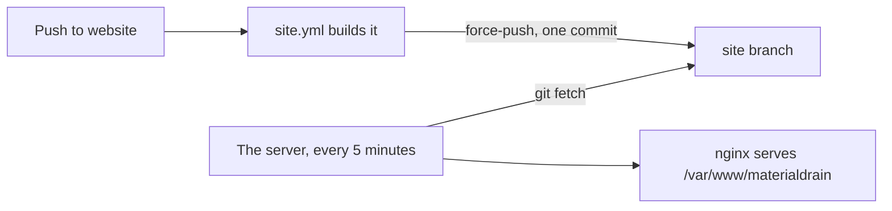

# This website

https://materialdrain.senko.tools has two parts: the **home page** at `/`, with the downloads, and **this
documentation** at `/docs/`. Both are made from the `website` branch, which shares no history with the app's branches.

## Where things are

| Path (on `website`) | What it is |
| --- | --- |
| `website/` | The home page: `index.html`, `style.css`, `releases.js` and `404.html`. Plain HTML, CSS and JavaScript, no build step |
| `docs/` | These pages, in Markdown, built with [MkDocs Material](https://squidfunk.github.io/mkdocs-material/) |
| `mkdocs.yml` | The documentation's settings: the theme, the Markdown extensions and the navigation |
| `docs/requirements.txt` | The exact versions of MkDocs and Material the site is built with |
| `docs/stylesheets/extra.css` | The documentation's colours, the same palette as `website/style.css` |
| `docs/server-setup/` | How the server serves the site, and the files it needs. Not published |
| `.github/workflows/site.yml` | Builds the site on every push to `website`, into the `site` branch |

Why a branch of its own: the documentation changes far more often than the app, and a change to it should never start
an app build or appear in the app's history. The app's branches (`main`, `dev`) hold only the app; see
[Development](index.md#the-branches).

## How it's published



1. **A push to `website`** runs the **Website** workflow (`.github/workflows/site.yml`). **Run workflow** on the
   Actions tab runs it without a change. A newer push cancels a build that's still running.
2. **The build** installs the pinned requirements, then:

    ```bash
    mkdocs build --strict --site-dir _site/docs
    cp -r website/. _site/
    ```

    The documentation goes to `_site/docs`, and the home page's files to the root of `_site`.
3. **The result is force-pushed to `site`** as a single new commit, "Site built from &lt;commit&gt;". The branch is
   replaced every time, so it never grows. The workflow only needs permission to write to the repository, no secrets.
4. **The server pulls `site`.** A systemd timer (`materialdrain-site-sync.timer`) runs a small script every 5 minutes
   (and a minute after booting). It fetches the branch; when the commit is a new one, it resets
   `/var/www/materialdrain` to it and drops the old builds so the folder doesn't grow. nginx serves that folder.

So a change shows on the site within about 5 minutes of its build finishing.

The server only ever reads from GitHub: nothing on GitHub can reach it, and the sync runs in a systemd sandbox that
can only write the site's folder. Setting up a server is described in `docs/server-setup/README.md`.

!!! warning "Never edit `site` by hand"
    `site` is output. The next build replaces it entirely, so a change made there is lost within minutes. Change
    `website` instead.

## Previewing it

You need Python 3 (the workflow uses 3.12). From the root of a checkout of `website`:

```bash
python3 -m venv .venv
source .venv/bin/activate
pip install -r docs/requirements.txt
mkdocs serve
```

`mkdocs serve` shows the documentation at http://127.0.0.1:8000 and reloads on every change you save. Before pushing,
build it the way the workflow does, so a mistake fails here and not there:

```bash
mkdocs build --strict
```

The home page asks for its files from the root of the site (`/style.css`, `/releases.js`), so serve its folder rather
than opening the file:

```bash
python3 -m http.server --directory website 8001
```

Its **Documentation** link (`/docs/`) only works on the real site, or if you run the workflow's two build commands and
serve `_site` instead. `site/` and `_site/` are in `.gitignore`.

The versions in `docs/requirements.txt` are pinned, so a new release of MkDocs or Material can't change or break the
site without anyone noticing. Raise them on purpose, and check the build when you do.

## Adding a page

1. Create the Markdown file under `docs/`, in the folder of its section, e.g. `docs/development/my-topic.md`. Start
   it with a single `#` title.
2. Add it to `nav` in `mkdocs.yml`, where it should appear:

    ```yaml
    nav:
      - Development:
          - development/index.md
          - My topic: development/my-topic.md
    ```

    A section's `index.md` is listed without a title: it becomes the section's own page (`navigation.indexes`).
3. Link to it from the pages it belongs with. Links are relative paths to the Markdown files, with an optional anchor:
   `[Conventions](conventions.md#tests)`, `[Hosts](../hosts/index.md)`.

The build is strict: a link to a page that doesn't exist, or a `nav` entry for a missing file, fails it, and nothing
is published until it's fixed. A page that's in `docs/` but deliberately not in the navigation goes under
`not_in_nav` in `mkdocs.yml` (like the old `provider-configuration.md`); files that aren't pages at all go under
`exclude_docs` (like `server-setup/`).

## Writing a page

Match the pages around it: plain words, short sentences, and the reason behind things, not just the steps. Tables for
reference, a diagram only where it shows something words don't, and code blocks with their language
(` ```kotlin `, ` ```json `, ` ```bash `).

These Markdown extensions are turned on in `mkdocs.yml`:

| Extension | For | Written as |
| --- | --- | --- |
| `admonition` | A boxed note, tip or warning | `!!! note "Title"`, then the text indented by four spaces |
| `pymdownx.details` | A box that opens on a click | `??? note "Title"` (closed) or `???+ note` (open) |
| `pymdownx.tabbed` | Tabs, for alternatives | `=== "First tab"`, then the content indented |
| `pymdownx.superfences` | Code blocks inside lists, tabs and notes, and Mermaid diagrams | ` ```mermaid ` |
| `pymdownx.highlight`, `pymdownx.inlinehilite` | Coloured code, also inline | ` ```kotlin `, `` `#!kotlin val x = 1` `` |
| `pymdownx.keys` | Keys to press | `++ctrl+c++` |
| `tables` | Tables | The usual pipes |
| `def_list` | A term and its meaning | `Term` on one line, `:   Meaning` on the next |
| `attr_list`, `md_in_html` | Classes on Markdown, Markdown inside HTML | `[Download](…){ .md-button }`, `<div class="grid cards" markdown>` |
| `toc` | The table of contents on the right, and a link on every heading | Headings (`##`, `###`) |

A few of them, written out:

=== "A note"

    ```markdown
    !!! note "Pixeldrain itself"
        The built-in Pixeldrain host isn't a config, so `screens` doesn't apply to it.
    ```

    Use them sparingly: a page full of boxes has nothing that stands out. `note`, `tip`, `info` and `warning` are the
    usual kinds.

=== "Tabs"

    ```markdown
    === "WebDAV"

        Text about WebDAV.

    === "S3"

        Text about S3.
    ```

=== "Details"

    ```markdown
    ??? info "Why it works this way"
        Hidden until it's clicked.
    ```

=== "A diagram"

    ````markdown
    ```mermaid
    flowchart LR
        app --> api[provider-api]
    ```
    ````

    `flowchart` and `sequenceDiagram` are the ones used so far.

=== "Keys"

    ```markdown
    Press ++ctrl+c++ to copy.
    ```

    Renders as: Press ++ctrl+c++ to copy.

The theme's features (`mkdocs.yml`, `theme.features`) add instant page loads, tabs for the top-level sections,
"back to top", search suggestions, a copy button on every code block, and tabs that switch together across a page
when they have the same title (`content.tabs.link`).

## The colours

The whole site is dark, in one palette: a dark rose. It's defined twice, in the same CSS variables with the same values:

- `website/style.css` for the home page.
- `docs/stylesheets/extra.css` for the documentation, which maps them onto Material's own variables
  (`--md-default-bg-color`, `--md-typeset-a-color`, the code colours and so on). `mkdocs.yml` sets the scheme to
  `slate` (dark) with `custom` primary and accent colours, so these are the only colours used.

| Variable | Value | Used for |
| --- | --- | --- |
| `--bg-main` | `#1a1617` | The page |
| `--bg-surface` | `#251f21` | The header, cards, code blocks, notes |
| `--accent-primary` | `#d4a5b2` | Accents, keywords in code |
| `--accent-highlight` | `#eec1c8` | The site's name in the header |
| `--link-color` | `#e2b2be` | Links |
| `--text-main` | `#f2ecee` | Text |
| `--text-muted` | `#b0a2a6` | Secondary text |

The rest (borders, the deeper and muted accents, the blue, red, green and yellow) are in both files. To change a
colour, change it in **both**, so the home page and the documentation stay one site.

## The downloads

The home page's download cards are filled in by `website/releases.js`, in the visitor's browser, from the repository's
GitHub releases. The app's build workflow publishes those (see [Development](index.md#the-build-workflow)); the website
only lists them, and every download comes straight from GitHub.

1. It asks `https://api.github.com/repos/fidesosu/Materialdrain/releases?per_page=30`. GitHub allows a visitor 60
   such requests an hour, so the answer is kept in `sessionStorage` for 5 minutes rather than asked for on every
   visit.
2. Drafts and releases without an `.apk` are left out.
3. **Stable** is the newest release that isn't a pre-release and isn't tagged `dev-build`. **Development** is the
   release tagged `dev-build`. Up to 8 older stable releases are listed under **Older versions**.
4. Each card links straight to its APK, and shows the version, the date and the size. The version is read from the
   APK's name (`Materialdrain-1.4.20261009.1530.apk` gives `1.4.20261009.1530`); releases from before the build
   workflow named their APKs differently, so for those it's the tag without its `v`.

If GitHub can't be reached, or the visitor's requests are used up, the page says so and the cards keep their plain
links to the releases page, which are in the HTML from the start. So the page works, if more plainly, without the
script.
