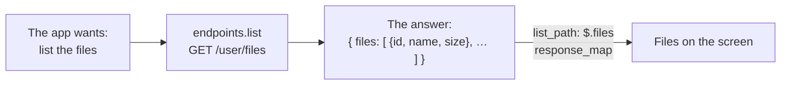

# REST API

`"kind": "generic_rest"`: any HTTP API, described in the config itself, request by request. No code is written for
the host. Pixeldrain is described this way too: its config ([`pixeldrain.json`](examples.md)) uses nearly every part
of this page, and is the best place to look at one that works.

## How it works, in short

The app needs certain things from a host: *list the files*, *upload a file*, *download a file by its id*, and so on.
Each of those has a name, an **endpoint**. A config describes the request each one is (its method and path) and where
the app finds what it needs in the answer (dot-paths like `$.file.name`). The endpoints a config describes decide what
the app offers: a config with only `list` and `download` gets a list of files that can be downloaded, and nothing more.



## Your first config, step by step

Say your API has `GET https://files.example.com/api/files`, answering:

```json
{ "items": [ { "id": "a1", "filename": "cat.jpg", "bytes": 52311, "created_at": "2024-05-01T10:00:00Z" } ] }
```

and `GET /files/{id}/content` for a file's content, both with a bearer token.

1.  **The basics**: where the API is, and how the key is sent.

    ```json
    {
      "kind": "generic_rest",
      "name": "My file server",
      "base_url": "https://files.example.com/api",
      "auth": { "type": "BEARER" },
      "endpoints": { }
    }
    ```

2.  **Listing the files**: `list` is the request, `list_path` where the array is in the answer, and `response_map`
    where each value is in one item.

    ```json
    "list": {
      "method": "GET",
      "path": "/files",
      "list_path": "$.items",
      "response_map": { "id": "$.id", "name": "$.filename", "size": "$.bytes", "created": "$.created_at" }
    }
    ```

3.  **Downloading**: `{id}` is filled in with the id the list gave.

    ```json
    "download": { "method": "GET", "path": "/files/{id}/content" }
    ```

4.  **Previews and thumbnails** load a file from an address, so give the file's address too: the same request as
    `download`, as `raw_id`.

    ```json
    "raw_id": { "method": "GET", "path": "/files/{id}/content" }
    ```

That's a working host: add it, enter the token as its API key, and the Files tab lists your files. From here, add the
endpoints for what else your API can do, from the [list below](#endpoints).

## Fields

| Field | Default | Meaning |
| --- | --- | --- |
| `base_url` | required | The API's address. Every endpoint's `path` is added to it |
| `endpoints` | required | The requests, by name; see [Endpoints](#endpoints) |
| `auth` | `{"type": "NONE"}` | How the sign-in goes with each request; see [Sign-in](sign-in.md) |
| `browse_root` | `""` | The folder the Filesystem tab starts at, and stays inside. Pixeldrain uses `me` |
| `send_credentials` | `true` | `false` never sends the sign-in at all: for a public host that mustn't see it |
| `account_fallback` | `false` | With no sign-in of its own, use the Pixeldrain account from **Settings → Account**. Only for configs of pixeldrain.com |
| `screens`, `meta` | | See [The config format](config-format.md) |

## A request

Every endpoint (and the sign-out, see [Sign-in](sign-in.md)) is a request described with these fields:

| Field | Default | Meaning |
| --- | --- | --- |
| `method` | required | `GET`, `POST`, `PUT`, `PATCH`, `DELETE` or `HEAD` |
| `path` | required | Added to `base_url`; or a whole `https://` address, for a host which serves files from another one |
| `body` | `RAW` | What's sent: `RAW` (the file for an upload, otherwise nothing), `MULTIPART` (a file upload form, the file as the field `file`), `FORM` (the `form` fields) or `JSON` (the `json` text) |
| `query` | none | Query parameters: `{ "name": "value" }` |
| `form` | none | The fields of a `FORM` body |
| `json` | none | The text of a `JSON` body |
| `success_status` | `[200, 201]` | The HTTP status codes that count as success |
| `response_map` | none | Where the app finds each value in the answer; see [The answer](#the-answer) |
| `list_path` | none | For a listing: where the array of items is. Left out, the answer itself is the array |
| `breadcrumb_path` | none | For a folder listing: where the folders leading to it are |
| `listing_map` | none | Values of a listing as a whole, e.g. whether a folder can be changed |

### Placeholders

`{name}`s in a `path`, `query`, `form` or `json` are filled in by the app; which ones there are depends on the endpoint
(see [the table](#endpoints)).

- In a **path**, a value keeps its slashes, each part encoded on its own: `{path}` can be `Photos/2024`. Commas are
  kept too, so several ids can go into one path: `/file/{ids}`.
- In **`query`** and **`form`**, a value that is exactly one placeholder, with nothing to fill in, is left out
  altogether. That makes optional flags easy: `"query": { "make_parents": "{make_parents}" }` is only sent when it's set.
- In **`json`**, a placeholder is replaced as it is, so values that have to be JSON come already encoded:
  `{title_json}` is a quoted string, `{files_json}` an array of ids.

    ```json
    "json": "{\"title\": {title_json}, \"files\": {files_json}}"
    ```

### The answer

`response_map` maps the names the app reads to **dot-paths** in the JSON answer: `$.` then the keys, separated by
dots, e.g. `$.file.name`. For a listing (with `list_path`), the paths are inside each item.

| Name | What it is |
| --- | --- |
| `id` | A file's (or list's) id: what the `{id}` endpoints take |
| `name` | The file's name, or a folder's |
| `path` | Where a file or folder is (for the `browse_*` endpoints) |
| `is_directory` | Whether it's a folder: `true`, or one of the words `dir`, `directory`, `folder` |
| `size` | The size in bytes |
| `mime_type` | The file's type, for previews. Left out, it's guessed from the name |
| `created`, `modified` | Dates, shown in the list and used for sorting: ISO 8601 (`2024-05-01T10:00:00Z`) or the web's `Wed, 01 May 2024 10:00:00 GMT`. *Modified* is shown when there's both |
| `username`, `quota_used`, `quota_total` | The account (`user_info`) |
| `title`, `file_count`, `can_edit` | A list (`user_lists`, `list_info`) |

`listing_map` takes `can_write` and `can_delete` for a folder, `title` and `can_edit` for a list. A value that isn't
mapped is taken from what the endpoints allow.

## Endpoints

Each name unlocks a part of the app; leave out what your API can't do. A file with an id (a flat file store) uses the
`{id}` endpoints, a file with a path (folders) the `browse_*` ones. A host which has both can declare both.

### Files tab

| Endpoint | Placeholders | What it is |
| --- | --- | --- |
| `list` | | The flat list of every file of the account. Turns on the **Files** tab |
| `file_info` | `{id}` | The details of one file |
| `download` | `{id}` | Downloading a file by its id |
| `download_archive` | `{ids}` | Several files at once as one zip; `{ids}` is the ids joined by commas |
| `delete` | `{id}` | Deleting a file by its id |

### Upload tab

| Endpoint | Placeholders | What it is |
| --- | --- | --- |
| `upload` | `{filename}` | Uploading a file with no folder of its own. Turns on the **Upload** tab. The answer's `id` is the new file's |

### Filesystem tab

| Endpoint | Placeholders | What it is |
| --- | --- | --- |
| `browse_list` | `{path}` | Listing one folder. Turns on the **Filesystem** tab |
| `browse_download` | `{path}` | Downloading a file by its path |
| `browse_upload` | `{path}`, `{make_parents}` | Uploading into a folder; `{path}` is the new file's path |
| `browse_thumbnail` | `{path}` | A file's thumbnail, by its path |
| `browse_mkdir` | `{path}`, `{action}` | Making a folder; `{action}` is `mkdir`, or `mkdirall` to make the folders leading to it too |
| `browse_rename` | `{path}`, `{target}`, `{make_parents}` | Renaming or moving; `{target}` is the new path |
| `browse_delete` | `{path}`, `{recursive}` | Deleting a file or a folder |
| `browse_import` | `{path}`, `{files_json}` | Copying files into a folder by their ids (Pixeldrain's *Import files by ID*) |
| `archive_info` | `{path}` | What's inside an archive, without downloading it: shown in the file's details. The answer is in Pixeldrain's `zip_info` shape (below) |
| `archive_file` | `{path}`, `{entry}` | One file out of an archive; `{entry}` is its path inside it |

??? info "The shape of an `archive_info` answer"
    The archive's top has `children`, an object mapping each entry's name to its own object. A folder's object has
    `children` too; a file's has its `size`. An archive that couldn't be read answers `"success": false`, with `value`
    and `message`.

    ```json
    { "children": { "photos": { "children": { "cat.jpg": { "size": 52311 } } }, "notes.txt": { "size": 120 } } }
    ```

### Lists tab

| Endpoint | Placeholders | What it is |
| --- | --- | --- |
| `user_lists` | | The lists of the account (`id`, `title`, `file_count`, `can_edit`). Turns on the **Lists** tab |
| `list_info` | `{list_id}` | The files of one list |
| `list_create` | `{title_json}`, `{files_json}` | Making a list |
| `list_update` | `{list_id}`, `{title_json}`, `{files_json}` | Changing a list's title or files |
| `list_delete` | `{list_id}` | Deleting a list |

### Account, previews and links

| Endpoint | Placeholders | What it is |
| --- | --- | --- |
| `user_info` | | The account's name and storage (`username`, `quota_used`, `quota_total`) |
| `thumbnail_id` | `{id}` | A file's thumbnail, by its id |
| `raw_id` | `{id}` | A file's own address: what previews play and show, and the share link when there's no `share_id` |
| `share_id` | `{id}` | The public page of a file, shared and copied as its link |
| `share_path` | `{path}` | The public page of a path |

## Thumbnails, previews and links

- **Thumbnails** come from `thumbnail_id` or `browse_thumbnail`, for photos and videos. The app reads songs' covers and
  videos' frames out of the files themselves (from `raw_id` or `browse_download`), and other kinds of file show a tile
  of their kind instead of a host's generic picture.
- **Previews** of images, video and audio load from `raw_id` or `browse_download`; video and audio stream, with seeking.
- **The share link** is `share_id`'s or `share_path`'s address when there is one; otherwise the file's own address.
- **The sign-in** goes with thumbnails and previews only when they load from under `base_url`. One served from
  another address (a CDN) gets none.

## A bigger example

A host with folders, sign-in by username and password, and file pages to share:

```json
{
  "kind": "generic_rest",
  "name": "Team files",
  "base_url": "https://files.example.com/api/v2",
  "auth": {
    "type": "BEARER",
    "password_auth": {
      "mode": "LOGIN",
      "login": { "method": "POST", "path": "/login", "body": "JSON",
                 "fields": { "user": "{username}", "pass": "{password}" }, "token": "$.token" }
    }
  },
  "endpoints": {
    "browse_list": {
      "method": "GET", "path": "/tree/{path}", "list_path": "$.entries",
      "response_map": { "name": "$.name", "path": "$.path", "is_directory": "$.type", "size": "$.size", "modified": "$.mtime" },
      "listing_map": { "can_write": "$.writable" }
    },
    "browse_download": { "method": "GET", "path": "/raw/{path}" },
    "browse_upload": { "method": "PUT", "path": "/raw/{path}", "query": { "mkdirs": "{make_parents}" } },
    "browse_mkdir": { "method": "POST", "path": "/tree/{path}", "query": { "op": "{action}" } },
    "browse_rename": { "method": "POST", "path": "/move", "body": "FORM", "form": { "from": "{path}", "to": "{target}" } },
    "browse_delete": { "method": "DELETE", "path": "/tree/{path}", "query": { "recursive": "{recursive}" } },
    "share_path": { "method": "GET", "path": "https://files.example.com/s/{path}" }
  },
  "meta": { "id": "com.example.team-files", "version": 1, "author": "You" }
}
```
