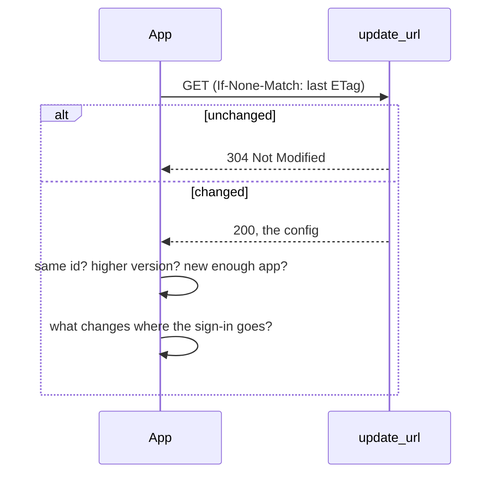

# Sharing and updates

A config has nothing secret in it, so it can be passed around: in a chat, as a file, or published on a website. A
published config can also update itself, so a fix you make reaches everyone who uses it.

## `meta`

```json
"meta": {
  "id": "com.example.my-nas",
  "version": 3,
  "author": "You",
  "update_url": "https://example.com/configs/my-nas.json",
  "min_app_version": 931170
}
```

| Field | Meaning |
| --- | --- |
| `id` | A stable name for the config, the same in every version. Reverse-domain style is a good habit: `com.example.my-nas` |
| `version` | A whole number. Raise it every time you publish a change |
| `author` | Shown in the app next to the version |
| `update_url` | An `https` address of the raw config file, where newer versions are fetched from |
| `min_app_version` | The lowest app **version code** that can use this version. An older app says it needs updating instead of breaking |

All of it is optional. Without `meta`, a config is simply never updated.

!!! info "The version code"
    The app's version code is the number of minutes from the start of 2025 (UTC) to the commit it was built from, so
    it goes up with every build. It can be worked out from the version name: `1.4.20261009.1530` was built from a
    commit at 2026-10-09 15:30 UTC, so its version code is `931170`. Use the version code of the first build that has what your config needs.

## Sharing a config

**Export** on the host's card copies the config's text exactly as it's saved. Whoever gets it pastes it under **Or
paste a config**, then enters their own sign-in.

Importing a config that's already there (the same `id` **and** the same `update_url`) replaces the old one instead of
adding a second, and keeps its sign-in. That's an easy way to hand someone a fixed version.

## How updates work



- **When:** when the app starts, at most once a day per config, for configs with auto-update on. There's no
  background job. **Check for updates** on a card (or **Check all for updates**) checks right away.
- **Only higher versions count.** A file with the same `version` is up to date, even if its text changed. So always
  raise `version` when publishing.
- **Same config only.** If the file has a different `id`, it's refused.
- **Cheap.** The app sends the `ETag` it got last time, so an unchanged file costs one tiny request. Files over 256 KB
  and addresses that aren't `https` are refused.
- **Auto-update** is a switch on the card, *Auto-update from &lt;host&gt;*. When it's off, an update is shown on the card
  (*Version 4 available*, and a download button) and waits for you.

### Updates that ask first

A config decides where your sign-in is sent. So an update that changes any of these is never applied on its own, even
with auto-update on:

| Change | For example |
| --- | --- |
| **Where requests go** | A new address (scheme, host or port) in `base_url`, `endpoint`, a full-address `path`, or the login |
| **How the sign-in is sent** | Another `auth.type`, another `header_name`, another login request |
| **Where updates come from** | A new `update_url` |
| **The kind** | Becoming another kind of host |

**Review update** lists every such change and asks. If the sign-in would go somewhere new (a new address or a new
kind), your saved key, username and password are removed on updating, so they're never sent there before you've
looked at the new address and entered them again.

Changes to paths, endpoints, field names or screens are not sensitive: they only change what requests look like.

### Edits and updates

Editing a config that updates from somewhere marks it **Edited**, since the next update would replace your edits. The
app asks what you want:

- **Stop updating** removes the update address, so your version stays.
- **Keep updates**: updates go on and will replace your edits. Auto-update is turned off for it once; turn it back on
  if that's what you want, and later edits leave it alone.

### Going back

After any update, **Revert update** on the card brings back the version before it, and turns auto-update off (or the
next check would just apply the update again).

## Publishing a config

1. Put the config somewhere with a stable `https` address that serves the raw file: a GitHub repository (the
   `raw.githubusercontent.com` address), a gist, your own server.
2. Give it an `id`, a `version` and that address as `update_url`.
3. For each change: edit, **raise `version`**, publish. Apps pick it up within a day of their next start.
4. If a change needs a newer app, set `min_app_version`; older apps keep the version they have and say why.
